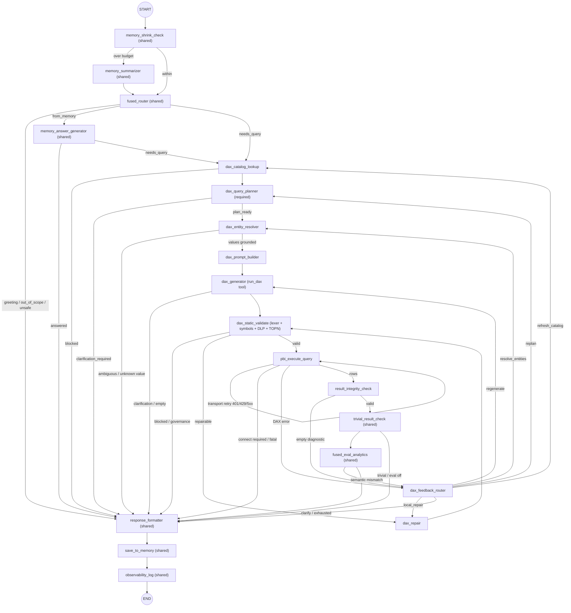

# Agent State Flow — Text-to-DAX (Power BI)

LangGraph state graph for the Jeen Insights **text-to-DAX** agent
(`src/agent/langgraph_agent_dax/graph.py`). It is a **distinct** graph from the
[text-to-SQL flow](./agent-state-flow.md): the query core (plan → generate →
static-validate → execute → repair) is DAX-specific, while everything after rows
return (memory, routing, insights/eval, response formatting, persistence,
observability) reuses the shared, engine-agnostic nodes **imported read-only**
from `src/agent/langgraph_agent`. Those shared files are never edited, so the SQL
flow cannot regress.

Power BI datasets are registered as ordinary connections
(`settings_services.service_type = 'powerbi'`, `category = 'database'`,
`connection_config = {workspace_id, dataset_id, tenant_id, client_id}` — no
secret). `resolve_agent` dispatches them to the `DaxAgentRegistry`
(`DaxInsightsAgent`) instead of the SQL `AgentRegistry`.

## Diagram

## Nodes

**Shared (imported read-only, unchanged from the SQL graph):**
`memory_shrink_check`, `memory_summarizer`, `fused_router`,
`memory_answer_generator`, `trivial_result_check`, `fused_eval_analytics`,
`response_formatter`, `save_to_memory`, `observability_log`.

**DAX-specific (new):**

| Node | Kind | Responsibility |
|------|------|----------------|
| `dax_catalog_lookup` | DB | Load curated metadata; split **MEASURES** from columns; detect a Date/Calendar table; fail closed (`catalog_blocked`) when no catalog is registered. |
| `dax_query_planner` | LLM | **Mandatory** typed plan (grain, dimensions, metrics, filters, sort, date role, relationship paths, row budget, assumptions, `clarification_required`). Fails *open* to a minimal aggregate plan on parse error. |
| `dax_entity_resolver` | DB | **Value linking**, no LLM. Verifies each plan filter's literal against the column's real values with a bounded, cached, read-only probe: corrects typos ("Mountaiin 300"), widens to `IN` when one phrase names several SKUs, searches sibling text columns when the value lives elsewhere, and asks the user when it is ambiguous or absent. Widening is the one change that can be wrong without looking wrong (the query still returns a plausible number), so it requires a multi-token phrase, a *complete* read of the column, and exact agreement on any digits — "Mountain 300" must never absorb "Mountain-3000". Fails *open* — an unverifiable literal is recorded in `unresolved_entities`, never blocked. Governed columns are never probed, and a cached domain is only served after the reader's entitlement is re-confirmed. |
| `dax_prompt_builder` | logic | Assemble the DAX system prompt (MEASURES vs COLUMNS, RELATIONSHIPS, DATE, plan) + the `structured_prompt` for the UI. |
| `dax_generator` | LLM | Emit a single DAX query via the `run_dax` tool, following the plan. Stores it in both `generated_dax` and `generated_sql` (so shared nodes read it unchanged). |
| `dax_static_validate` | logic | Read-only/shape gate, balanced delimiters, single top-level `EVALUATE`, `DEFINE MEASURE/VAR`-only, banned MDX/DMV/DDL, symbol resolution (`'Table'[Column]` vs `[Measure]`), DLP over columns + measure lineage, TOPN-present for detail grain. **No sqlglot.** DLP matching is separator-insensitive here: the shared patterns are underscore-style because they were written for SQL identifiers, but a tabular model names columns for humans, so `Social Security Number`, `social_security_number` and `SocialSecurityNumber` are all one governed column. Text-to-SQL matching is unchanged. |
| `dax_repair` | LLM | Focused pre-execution repair of a query that failed static validation (bounded budget). |
| `pbi_execute_query` | REST | Resolve the request-scoped delegated token, POST `executeQueries`, handle transport retries inline (401 refresh once; 429 `Retry-After`; 5xx backoff). Token never enters graph state. |
| `result_integrity_check` | logic | Annotate empty/partial results; a valid empty result is a **success**. At most one empty-result diagnostic regeneration. |
| `dax_feedback_router` | logic | DAX error taxonomy → repair/replan action with **separate** budgets (see below). |

## Error taxonomy & budgets (`dax_feedback_router`)

Categories → action:

- `LEXICAL_OR_SHAPE` / `IDENTIFIER_KIND` / `MEASURE_OR_TYPE` → local repair once, then regenerate.
- `UNKNOWN_MODEL_OBJECT` → refresh catalog once (model may be stale), else regenerate.
- `CONTEXT_SEMANTICS` / `SEMANTIC_MISMATCH` → regenerate from plan.
- `RELATIONSHIP_PATH` / `TIME_SEMANTICS` → replan (or clarify for business meaning).
- `RESOURCE_LIMIT` / `PARTIAL_RESULT` → regenerate with a "tighten grain/TOPN" note.
- `EMPTY_OR_BLANK` → re-resolve entities when a filter literal was never verified (a zero-row result is far more often a bad literal than bad DAX), else one diagnostic regeneration, then accept.
- `AUTHN` (401) → refresh + replay inline. `AUTHZ_OR_TENANT` (403/tenant) → stop with a config error. `THROTTLED` (429) / `TRANSIENT_SERVICE` (5xx) → bounded inline retries.
- `UNSAFE_OR_GOVERNED` → block. `EXHAUSTED` → best safe explanation.

Budgets: **1** local repair/query, **2** plan regenerations, **1** catalog
refresh, **2** entity resolutions, **1** empty-result diagnostic, **3** inline
transport retries — tracked per category so the graph never loops blindly.

## `executeQueries` constraints (drive the client + validator)

Legacy JSON `POST /v1.0/myorg/groups/{workspaceId}/datasets/{datasetId}/executeQueries`:

- **One query per call, one result table per query.** Max 100,000 rows /
  1,000,000 values / ~15 MB. No `queryTimeout`/`resultSetRowCountLimit` params —
  row-capping is done with `TOPN` inside the DAX.
- **HTTP 200 can carry errors** (e.g. "More than one result table", "More than N
  rows"). The client inspects the top-level `error`, each `results[i].error`, and
  each `results[i].tables[j].error`, and rejects partial/truncated results.
- Column keys come back as `Table[Column]` (qualified) or `[Alias]` (renamed) —
  normalized to friendly keys.
- **Permissions:** delegated `Dataset.Read.All` is necessary but **not
  sufficient** — the user also needs workspace access, dataset **Read + Build**,
  and the tenant setting *"Dataset Execute Queries REST API"* enabled. Azure
  Analysis Services / on-prem live-connect models are unsupported.

## Delegated OAuth (per-user token)

The signed-in user's delegated token is resolved **at query time** inside
`pbi_execute_query` via `PowerBiTokenProvider` (connector-grant subsystem):
identity → Power BI grant → valid access token (refreshed once on 401). The
token is request-scoped and is **never** stored in graph state, trace, or memory.

When the user hasn't linked (or must re-link) their Power BI account, the flow
returns `needs_connect=True` + `connect_provider="power-bi"`; the UI renders a
"Connect Power BI" button that kicks off `/integrations/power-bi/connect`.

## Configuration

Settings live in `src/config.py` (all reuse `AZURE_AD_*` /
`CONNECTORS_TENANT_ID` / `APP_ENCRYPTION_KEY` for auth + crypto):

- `POWERBI_API_BASE` — REST base URL (override only for sovereign clouds).
- `POWERBI_DEFAULT_SCOPE` — delegated resource scope for token refresh fallbacks.
- `POWERBI_EXECUTE_TIMEOUT_SECONDS` — per-call `executeQueries` client timeout.
- `DAX_MAX_RETRIES` — max DAX repair/regeneration attempts (separate from the
  fixed transport-retry budget).
- `DAX_VALIDATION_ENABLED` — toggle the static validator (mirrors
  `SQLGLOT_VALIDATION_ENABLED`).

### Provisioning (no code)

1. **Entra app:** grant the delegated Power BI Service permission
   `Dataset.Read.All` plus the reserved OpenID scopes
   (`openid`/`profile`/`email`/`offline_access`); grant admin consent.
2. **Tenant setting:** enable *"Dataset Execute Queries REST API"* in the Power
   BI admin portal (for the relevant security group).
3. **Per user:** workspace access + dataset **Read + Build**.
4. **Connector:** create the `power-bi` connector via the admin API (client
   id/secret/tenant, group grants, enable).
5. **Connection:** register the dataset row in `settings_services`
   (`service_type='powerbi'`, `connection_config={workspace_id, dataset_id,
   tenant_id, client_id}`) and populate its metadata (tables, columns, and
   **measures**).

### Measures

Measures are essential for DAX (curated-measure-first). They are additive
metadata: a curated measure is a `metadata_columns` row whose `data_type` marks
it as a measure (`measure`, `dax_measure`, `measure (dax)`, …). No schema change
is required; when a dataset has no such rows the pipeline **degrades
gracefully** to column aggregation with a stated assumption
(`measures_available=False`).
