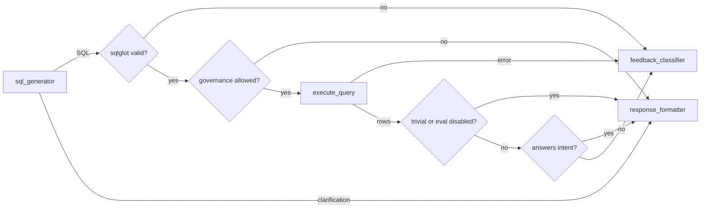

# Agent State Flow

LangGraph state graph for the Jeen Insights text-to-SQL agent.
Every query passes through this graph from `START` to `END`.

> **Full end-to-end path** (UI → Flask → API → pre-graph → LangGraph → insights/charts):
> see [question-to-answer-flow.md](./question-to-answer-flow.md).

## Diagram

```mermaid
flowchart LR
    S([START])
    E([END])

    subgraph Memory["Memory"]
        MSC["memory_shrink_check\nlogic"]
        MS["memory_summarizer\nLLM"]
        MAG["memory_answer_generator\nLLM"]
    end

    subgraph Routing["Routing"]
        FR["fused_router\nLLM"]
    end

    subgraph CatalogPrompt["Catalog + Prompt"]
        CL["catalog_lookup\nDB or MCP"]
        PB["prompt_builder\nlogic"]
    end

    subgraph SqlSafety["SQL + Safety"]
        SG["sql_generator\nLLM"]
        SV["sqlglot_validate\nlogic"]
        DC["dlp_check\nlogic"]
    end

    subgraph ExecutionEval["Execution + Eval"]
        EQ["execute_query\nDB"]
        TRC["trivial_result_check\nlogic"]
        FEA["fused_eval_analytics\nLLM"]
        FC["feedback_classifier\nlogic"]
    end

    subgraph Output["Output"]
        RF["response_formatter\nlogic"]
        STM["save_to_memory\nDB"]
        OL["observability_log\nlogic"]
    end

    S --> MSC
    MSC -->|over budget| MS
    MSC -->|within budget| FR
    MS --> FR

    FR -->|needs_query| CL
    FR -->|from_memory| MAG
    FR -->|out_of_scope / unsafe / greeting| RF

    MAG -->|answer ready| RF
    MAG -->|needs fresh data| CL

    CL --> PB --> SG

    SG -->|SQL generated| SV
    SG -->|clarification / empty| RF

    SV -->|valid| DC
    SV -->|syntax error| FC

    DC -->|safe| EQ
    DC -->|blocked| RF

    EQ -->|rows returned| TRC
    EQ -->|exec error| FC

    TRC -->|trivial or eval disabled| RF
    TRC -->|needs evaluation| FEA

    FEA -->|answers intent| RF
    FEA -->|wrong result| FC

    FC -->|exhausted retries| RF
    FC -->|missing table| CL
    FC -->|syntax / exec / semantic| SG

    RF --> STM --> OL --> E
```

## Parallel vs Logical Branches

The columns above are logical groupings, not simultaneous LangGraph execution. At runtime the graph follows one route through alternatives such as memory answer, normal SQL generation, blocked request, retry, or terminal formatting.

The true parallel work happens before `START`: `JeenInsightsAgent.process_question()` uses `asyncio.gather()` to resolve the user, load short-term memory, create the audit row, and preload catalog metadata. Once `graph.ainvoke()` starts, trace events are emitted in node execution order.

## Execution and State Model

`AgentState` is a `TypedDict` with partial updates: each node receives the current
state, returns only the fields it changed, and LangGraph merges that update before
the next node runs. Most fields use last-writer-wins semantics. The exception is
`trace`, whose `operator.add` reducer appends one timing event per wrapped node.

The graph is compiled once per data connection by `JeenInsightsAgent`. Per-request
inputs such as the question, selected connection, session history, row limit,
temperature, timeout, and optional eval override seed the initial state.

The main graph has no LangGraph checkpointer: each `ainvoke()` owns state only
for that request and cannot be resumed. Multi-turn continuity instead comes from
conversation history and result artifacts loaded before `START`, then written by
the application-level `ConversationHistoryService`.

| State area | Important fields | How it is used |
|------------|------------------|----------------|
| Request and connection | `question`, `source_key`, `session_id`, connection schema/catalog | Defines the user request and allowed data source. |
| Memory and routing | `conversation_history`, `memory_summary`, `route` | Chooses an answer-from-memory path or a live-query path. |
| Catalog and prompt | `metadata_bundle`, `known_tables`, `table_columns`, `system_prompt` | Separates the full validation allowlist from the metadata exposed to the SQL model. |
| SQL retry loop | `generated_sql`, `sqlglot_error`, `exec_error`, `error_context`, `retry_count` | Carries failure detail into the next SQL-generation attempt. |
| Result and evaluation | `query_result`, `is_trivial`, `eval_result` | Controls whether evaluation runs and supplies the final answer/insights. |
| Output and telemetry | `formatted_response`, `token_usage`, `trace` | Provides the API payload and complete developer trace. |

## Node Reference

| Icon | Node | Type | Description |
|------|------|------|-------------|
| 🧠 | `memory_shrink_check` | Logic | Estimates history at roughly four characters per token and marks it over budget only when it exceeds the configured limit. |
| 🤏 | `memory_summarizer` | LLM | Condenses prior questions and SQL into `memory_summary`; increments LLM latency and token counters. |
| 🔀 | `fused_router` | LLM | Uses a local regex for simple greetings (no LLM call); otherwise classifies `needs_query`, `from_memory`, `out_of_scope`, or `unsafe`. Invalid router JSON defaults to `needs_query`. |
| 💬 | `memory_answer_generator` | LLM | Answers from history and cached prior results, replays a cached matching result when available, or sets `route=needs_query` when fresh data is required. |
| 📦 | `catalog_lookup` | DB/MCP | Loads catalog metadata, extracts the full table/column allowlist, and fails closed when a catalog is required but unavailable. MCP failures fall back to the metadata DB. |
| 🔧 | `prompt_builder` | Logic | Renders the SQL system prompt and developer-visible structured prompt. For large catalogs it can prune only the prompt context; validation still retains the full allowlist. |
| 🧠 | `sql_generator` | LLM | Calls the primary model with the `run_sql` schema, extracts SQL from a tool call or text, or stores a clarification. Retries receive `error_context`. |
| ✅ | `sqlglot_validate` | Logic | When enabled, checks parsing, single-statement read-only structure, schema/catalog qualifiers, catalogued tables, and conservative column references. |
| 🛡️ | `dlp_check` | Logic | Blocks governed columns before execution. It resolves referenced columns (including `SELECT *`) when possible and otherwise falls back to a raw SQL scan. |
| ▶ | `execute_query` | DB | Executes through the connection's read-only `SqlRunner`, applying the request limit, hard row cap, and statement timeout; execution latency accumulates across retries. |
| ⚡ | `trivial_result_check` | Logic | Marks a result trivial when it has at most one row and five columns, skipping the evaluation LLM call. |
| 📊 | `fused_eval_analytics` | LLM | Evaluates result-to-intent fit using full-data statistics plus a small row sample; invalid eval JSON does not block a valid result. |
| 🔁 | `feedback_classifier` | Logic | Classifies validation, execution, and semantic failures; supplies repair context and routes retries to SQL generation or catalog reload. |
| 📋 | `response_formatter` | Logic | Builds the response contract, selecting clarification, governance, route, evaluation, or trivial-result answer text. |
| 💾 | `save_to_memory` | DB | Best-effort persistence of SQL, execution state, preview, and a result artifact for future follow-up questions. |
| 🪵 | `observability_log` | Logic | Emits the final `QUERY_EVENT` JSON log with route, retries, token counts, timing, and connector error type. |

## Node Types

The type labels are trace-panel categories, not a strict declaration of I/O:
`prompt_builder`, for example, is categorized as logic but may load a managed
prompt template.

| Type | Color | Role |
|------|-------|------|
| **LLM** | Purple | Calls the language model — `memory_summarizer`, `fused_router`, `memory_answer_generator`, `sql_generator`, `fused_eval_analytics` |
| **DB** | Green | Reads from or writes to a database or catalog provider — `catalog_lookup`, `execute_query`, `save_to_memory` |
| **Logic** | Gray | Routing, transformation, validation, formatting, and observability work |

## Runtime Decision Logic

### 1. Memory and intent routing

1. `memory_shrink_check` estimates the size of `conversation_history`.
2. If it is over `LANGGRAPH_MAX_HISTORY_TOKENS` (default `3000`), the graph
   calls `memory_summarizer`; otherwise it routes directly to `fused_router`.
3. `fused_router` short-circuits greetings locally. For other questions it sees
   a summary (or the last three turns), a manifest of prior result artifacts,
   and the connection display name.
4. The route determines the next node:

| Route | Next node | Database access |
|-------|-----------|-----------------|
| `needs_query` | `catalog_lookup` | Continues toward a live query. |
| `from_memory` | `memory_answer_generator` | No live query unless the answer node requests one. |
| `greeting`, `out_of_scope`, `unsafe` | `response_formatter` | No catalog or user-data query is run. |

The memory-answer node has two special controls: `{ "needs_query": true }`
re-enters the live-query path, while `{ "reuse_prior": true }` attempts to
replay a matching cached prior result. If that result has expired from the
cache, it safely falls back to a fresh query.

### 2. Catalog, prompt, and SQL generation

`catalog_lookup` is a safety gate, not merely prompt enrichment. It loads the
bundle for the current `source_key`, records provider/cache metadata, and builds
the `known_tables` and `table_columns` validation allowlists.

- When `REQUIRE_CATALOG_FOR_QUERY=true` (the default), an empty or failed catalog
  sets `catalog_blocked` and goes directly to `response_formatter`; SQL generation
  and execution do not occur.
- When configured for MCP, a catalog-provider failure falls back to the metadata
  DB. The graph records the provider actually used.
- `prompt_builder` may schema-link a large catalog to a smaller relevant subset
  for the model prompt. This does not narrow `known_tables` or `table_columns`,
  so prompt pruning cannot reject an otherwise valid catalogued query.
- `sql_generator` sends the rendered system prompt, prior SQL turns, and the
  current question to the primary model. It accepts a `run_sql` tool call, a SQL
  code fence, or a bare `SELECT` as SQL. A non-SQL model response becomes a
  clarification and ends the live-query path.

### 3. Validation, governance, execution, and evaluation

SQL validation is configurable but layered:

1. `sqlglot_validate` validates the SQL before it reaches the runner. With the
   default settings it requires exactly one read-only statement, validates allowed
   schema/catalog qualifiers, and checks catalogued table and unambiguous column
   names.
2. `dlp_check` applies built-in sensitive-name patterns (`password`, `ssn`,
   `credit_card`, `pin`, `secret`, keys, and tokens) plus configured
   `DLP_GOVERNED_COLUMNS`. A block is terminal and never reaches the data source.
3. `execute_query` calls the runner, which retains its own read-only enforcement
   as a second boundary. A request uses its supplied limit, subject to the
   runtime hard row cap and statement timeout.
4. `trivial_result_check` skips evaluation for results of at most `1 × 5`
   (rows × columns), or evaluation is skipped when disabled globally or by the
   per-request override.
5. `fused_eval_analytics` receives a profile computed from the returned result
   set (scanning up to 100,000 rows) plus up to 12 sample rows. A response with
   `answers_intent=false` enters the repair loop; malformed eval output defaults
   to `answers_intent=true` so it cannot discard an otherwise valid query result.

## Key Loops

- **Retry loop** — `feedback_classifier` increments `retry_count` for each
  repairable failure. Syntax, execution, and semantic failures return to
  `sql_generator`; an error containing `not found in catalog` reloads the catalog
  first. With the default `LANGGRAPH_MAX_RETRIES=3`, the graph allows three repair
  attempts after the initial SQL generation; the next failure is terminal.
- **Memory escape** — `memory_answer_generator` can fall through to the full SQL path
  when conversation history is insufficient to answer.
- **Eval rejection** — `fused_eval_analytics` sends the result back to `feedback_classifier`
  when the SQL result does not satisfy the original user intent.

## Terminal Work and Observability

Every route ends with the same tail: `response_formatter` → `save_to_memory` →
`observability_log` → `END`.

- The formatter returns the API contract: question/session/query IDs, SQL,
  result data, answer, prompt, error, metrics, and available insights.
- The complete trace is attached **after** the graph finishes so it includes
  `save_to_memory` and `observability_log`; each event includes node timing and
  is enriched with route, SQL, catalog, or error detail where applicable.
- History writes are best effort. A persistence failure is logged but does not
  replace a successfully formatted answer.
- `observability_log` emits one `QUERY_EVENT` record per graph run. It includes
  route, retry count, LLM calls/tokens/latency, SQL execution time, elapsed time,
  error status, connector error type, and query ID.

## Standalone Insights Eval Graph

`build_insights_eval_graph()` defines a separate one-node graph, `START → eval →
END`, used by the insights API after a main query has returned. It uses
`InsightsState` rather than `AgentState`, accepts a question, SQL, rows, row
count, and optional full-data statistics, then returns the summary, insights,
suggestions, and follow-up questions. It does not run catalog lookup, SQL
generation, validation, or database execution.

## Operational Configuration

| Setting | Default | Effect |
|---------|---------|--------|
| `LANGGRAPH_MAX_RETRIES` | `3` | Number of repair attempts after an initial SQL failure. |
| `LANGGRAPH_MAX_HISTORY_TOKENS` | `3000` | Estimated conversation-history threshold that triggers summarization. |
| `REQUIRE_CATALOG_FOR_QUERY` | `true` | Fails closed when no usable catalog exists. |
| `SQLGLOT_VALIDATION_ENABLED` | `true` | Enables SQL structure and catalog validation before execution. |
| `SCHEMA_QUALIFIER_VALIDATION_ENABLED` | `true` | Rejects a qualified table outside the configured schema/catalog. |
| `DLP_ENABLED` | `true` | Enables sensitive-column governance checks. |
| `DLP_GOVERNED_COLUMNS` | empty | Adds comma-separated organization-specific governed column names. |
| `EVAL_ANALYTICS_ENABLED` | `true` | Runs evaluation for non-trivial results unless overridden per request. |
| `SCHEMA_LINK_ENABLED` | `true` | Prunes large catalog context for the prompt only; validation remains full-catalog. |

## Source

Graph definition: `src/agent/langgraph_agent/graph.py`
Node implementations: `src/agent/langgraph_agent/nodes/`
