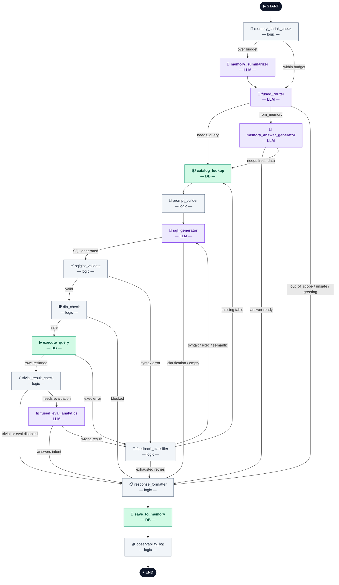

# Agent State Flow

LangGraph state graph for the Jeen Insights text-to-SQL agent.
Every query passes through this graph from `START` to `END`.

> **Full end-to-end path** (UI → Flask → API → pre-graph → LangGraph → insights/charts):
> see [question-to-answer-flow.md](./question-to-answer-flow.md).

## Diagram

## Node Reference

| Icon | Node | Type | Description |
|------|------|------|-------------|
| 🧠 | `memory_shrink_check` | Logic | Checks whether conversation history exceeds the token budget |
| 🤏 | `memory_summarizer` | LLM | Condenses history into a short summary when over budget |
| 🔀 | `fused_router` | LLM | Classifies the question: `needs_query`, `from_memory`, `out_of_scope`, `unsafe`, `greeting` |
| 💬 | `memory_answer_generator` | LLM | Answers directly from conversation history; escapes to SQL path if needed |
| 📦 | `catalog_lookup` | DB | Loads table/column metadata from the metadata database |
| 🔧 | `prompt_builder` | Logic | Assembles the dynamic system prompt with injected metadata |
| 🧠 | `sql_generator` | LLM | Generates SQL or returns a clarification message |
| ✅ | `sqlglot_validate` | Logic | Parses and validates SQL syntax and table references via sqlglot |
| 🛡️ | `dlp_check` | Logic | Blocks governed columns or unsafe SQL patterns before execution |
| ▶ | `execute_query` | DB | Runs the SQL against PostgreSQL in a read-only transaction |
| ⚡ | `trivial_result_check` | Logic | Skips expensive eval for tiny/direct results |
| 📊 | `fused_eval_analytics` | LLM | Evaluates whether the result answers the intent; produces summary + insights |
| 🔁 | `feedback_classifier` | Logic | Routes errors back to `sql_generator` or `catalog_lookup`; gives up after max retries |
| 📋 | `response_formatter` | Logic | Formats the final API response payload |
| 💾 | `save_to_memory` | DB | Persists the query record and result to conversation history |
| 🪵 | `observability_log` | Logic | Logs route, retries, token counts, latency, and final status |

## Node Types

| Type | Color | Role |
|------|-------|------|
| **LLM** | Purple | Calls the language model — `memory_summarizer`, `fused_router`, `memory_answer_generator`, `sql_generator`, `fused_eval_analytics` |
| **DB** | Green | Reads from or writes to a database — `catalog_lookup`, `execute_query`, `save_to_memory` |
| **Logic** | Gray | Pure Python, no external I/O — all remaining nodes |

## Key Loops

- **Retry loop** — `feedback_classifier` routes back to `sql_generator` (syntax/exec/semantic errors)
  or to `catalog_lookup` (missing table) until retries are exhausted (default max: 3).
- **Memory escape** — `memory_answer_generator` can fall through to the full SQL path
  when conversation history is insufficient to answer.
- **Eval rejection** — `fused_eval_analytics` sends the result back to `feedback_classifier`
  when the SQL result does not satisfy the original user intent.

## Source

Graph definition: `src/agent/langgraph_agent/graph.py`
Node implementations: `src/agent/langgraph_agent/nodes/`
