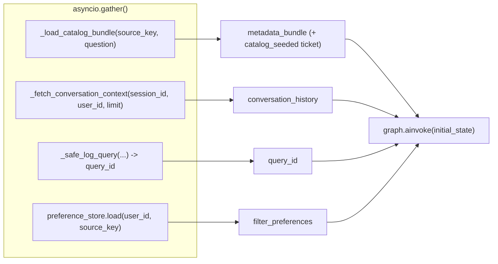
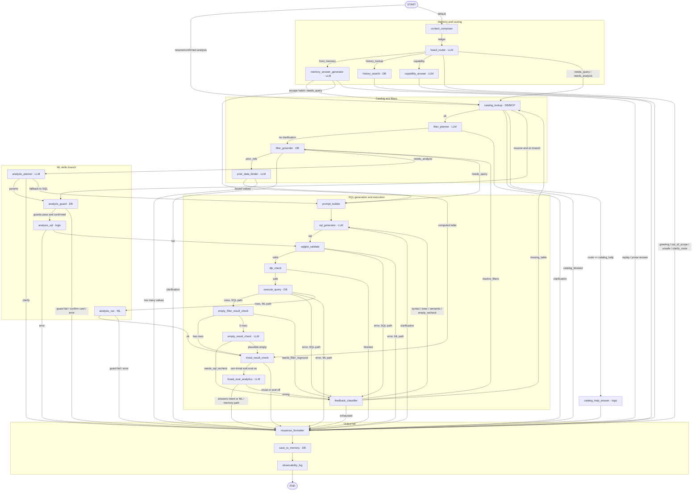

# Agent State Flow

How the Jeen Insights text-to-SQL agent answers a question, end to end. This is
the LangGraph state graph built by `build_graph()` in
[`src/agent/langgraph_agent/graph.py`](../src/agent/langgraph_agent/graph.py):
every question passes through it from `START` to `END`.

**27 nodes · 63 arcs · 20 conditional routers · recursion limit 72 · no
checkpointer.**

> Related docs:
> - Full end-to-end path (UI → Flask → API → pre-graph → LangGraph →
>   insights/charts): [question-to-answer-flow.md](./question-to-answer-flow.md).
> - ML skills branch in depth: [ml-skills.md](./ml-skills.md).
> - Draw.io renders (grouped overview + per-node/per-arc descriptions):
>   [agent-state-flow.drawio](./agent-state-flow.drawio) — the Mermaid diagram in
>   this file is the source of truth; the `.drawio` is regenerated separately.
> - DAX agent (a separate graph): [agent-state-flow-dax.md](./agent-state-flow-dax.md).

---

## 1. The graph at a glance

`build_graph()` is the single factory called by `JeenInsightsAgent.__init__`. It
wires every node factory to its service dependencies and returns a compiled
`CompiledStateGraph` invoked with `await graph.ainvoke(state)`.

The graph is compiled **once per data connection** (`source_key`) and reused for
every question on that connection. There is no LangGraph checkpointer:
multi-turn continuity comes from the conversation window loaded *before* `START`
and written back by `save_to_memory` at the end.

The 27 nodes fall into five phases. At runtime a question follows **one** route
through them — the phases below are logical groupings, not parallel stages.

| Phase | Nodes |
|-------|-------|
| Memory & routing | `context_composer`, `fused_router`, `capability_answer`, `catalog_help_answer`, `memory_answer_generator`, `history_search` |
| Catalog & filters | `catalog_lookup`, `filter_planner`, `filter_grounder`, `prior_data_binder`, `prompt_builder` |
| ML skills branch | `analysis_planner`, `analysis_guard`, `analysis_sql`, `analysis_run` |
| SQL generation & execution | `sql_generator`, `sqlglot_validate`, `dlp_check`, `execute_query`, `empty_filter_result_check`, `empty_result_check`, `trivial_result_check`, `fused_eval_analytics`, `feedback_classifier` |
| Output tail | `response_formatter`, `save_to_memory`, `observability_log` |

The only genuinely concurrent work happens **before** `START`:
`JeenInsightsAgent.process_question()` uses `asyncio.gather()` to resolve the
user, load the conversation window, insert the audit row and preload the
catalog (see §2).

---

## 2. Entry point & pre-graph bootstrap

Source: [`src/agent/jeen_insights_agent.py`](../src/agent/jeen_insights_agent.py).

`AgentRegistry.get_agent(source_key)` lazily builds one `JeenInsightsAgent` (and
one compiled graph) per connection, sharing the heavy collaborators (LLM
services, metadata loader, history service, prompt loader, ML-skills stores).
`build_graph(...)` reads the feature flags from `settings` and passes them into
the node factories:

| Setting | Gate |
|---------|------|
| `ML_SKILLS_ENABLED` | Enables the `needs_analysis` route and the whole ML branch. |
| `DLP_ENABLED` / `DLP_GOVERNED_COLUMNS` | Governed-column check in `dlp_check`. |
| `SQLGLOT_VALIDATION_ENABLED` | SQL structure/allowlist validation. |
| `SCHEMA_QUALIFIER_VALIDATION_ENABLED` | Reject cross-schema/catalog table references. |
| `EVAL_ANALYTICS_ENABLED` | Narration for non-trivial results. |
| `LANGGRAPH_EMPTY_RECHECK` | `empty_result_check` LLM 0-row diagnosis. |
| `REQUIRE_CATALOG_FOR_QUERY` | Fail closed without a usable catalog. |
| `LANGGRAPH_MAX_RETRIES` | SQL repair budget. |
| `SQL_FILTER_*`, `MEMORY_*`, `ANALYSIS_*` | Filter grounding, memory and ML limits. |

### Request flow

`process_question(...)` (or `process_confirmed_analysis(...)` for an
`/api/analysis/run` re-entry) calls the internal `_run(...)`, which:

1. Resolves the user (`SimpleUserResolver`) and loads live runtime settings
   (`get_runtime_settings()` — DB statement timeout, row cap,
   `conversation_context_turns`, and every `sql_filter_*` control).
2. Persists any filter-clarification answers this request carries, then runs
   **four independent calls in parallel** via `asyncio.gather(...,
   return_exceptions=True)`:

3. Seeds `initial_state` (an `AgentState` dict) with every field group — input,
   connection, audit, memory, routing, catalog, filter controls, SQL loop,
   validation, execution, empty-recheck, evaluation, feedback, per-request
   overrides, ML skills, output. For an ML re-entry the `analysis` overlay
   (`analysis_skill`, `analysis_params`, `analysis_resume`,
   `analysis_confirmed`, `route = needs_analysis`) is merged on top.
4. Invokes the graph, then attaches the **complete** execution trace to
   `formatted_response`: `slim_trace` is persisted first (no prompts/SQL), then
   `_enrich_trace` hangs the rendered prompts and human-readable detail off each
   event for the developer panel.

### Failure handling before `START`

Each parallel call is non-fatal. A failed **audit insert** continues with
`query_id=None` and surfaces `pre_graph_error` in `formatted_response["error"]`.
A failed **catalog preload** is deliberately *not* surfaced as `state["error"]`
— it is only a head start; `catalog_lookup` retries inside the graph and, if it
also fails, fails closed with a user-facing message (seeding `state["error"]`
here would outlive that recovery, because `response_formatter` prefers
`state["error"]` over everything else).

### The `catalog_seeded` one-shot ticket

When the preload returns a bundle, `initial_state["catalog_seeded"] = True`.
`catalog_lookup` consumes it once (reusing the pre-graph bundle instead of
loading a second time) and clears it, so the explicit refresh routes
(`missing_table`) still trigger a genuine reload.

---

## 3. Full pipeline diagram

The subgraphs are logical groupings, not simultaneous execution. For a given
question the graph follows exactly one route through the diagram.

---

## 4. Execution and state model

`AgentState` (see [`state.py`](../src/agent/langgraph_agent/state.py)) is a
`TypedDict` with **partial updates**: each node returns only the fields it
changed and LangGraph merges them (last-writer-wins), except `trace`, whose
`operator.add` reducer appends one timing event per node.

Every node is wrapped by `_timed` in `graph.py`, which:

- emits `node_started` / `node_finished` (or `node_failed`) progress events for
  the SSE query route (via `emit_progress`), and
- appends `{"node", "elapsed_ms", "icon", "type"}` to `state["trace"]`.

Node `type` is one of `llm`, `db`, `logic`, `ml` (used for the trace panel's
icon and grouping). LLM nodes additionally record their rendered prompt in
`node_prompts[node_name]` so the developer panel can show the exact prompt used
at every stage.

---

## 5. AgentState field-group reference

Fields are written by the nodes noted; every node reads the full state.

| Group | Key fields | Written by / used for |
|-------|-----------|-----------------------|
| Input | `question`, `session_id`, `source_key`, `user_context`, `limit`, `temperature`, `progress_callback` | Set once before `ainvoke`. |
| Connection | `connection_display_name`, `database_type`, `connection_database`, `connection_catalog`, `connection_schema` | From the `Connection`; defines the allowed data source. |
| Audit | `query_id`, `user_id`, `start_time`, `llm_call_count`, `llm_latency_ms`, `token_usage` | Seeded pre-graph; accumulated by every LLM node. |
| Memory | `conversation_history`, `memory_window`, `memory_ledger`, `memory_telemetry`, `prior_refs`, `memory_action`, `prior_bindings`, `history_query`, `history_matches` | `context_composer` builds the ledger; router/memory nodes/binder read it. |
| Routing | `route`, `route_reason`, `route_source`, `route_clarification` | `fused_router`. Which branch answers the question. |
| ML skills | `analysis_skill`, `analysis_params`, `analysis_resume`, `analysis_confirmed`, `analysis_confirm_required`, `analysis_override_guards`, `analysis_proposal`, `analysis_clarification`, `analysis_guard_failure`, `analysis_guard_results`, `analysis_span`, `analysis_result`, `analysis_definition`, `analysis_dropped_filters`, `analysis_error`, `low_confidence`, `parent_query_id`, `analysis_enabled_override` | `analysis_planner` / `guard` / `sql` / `run`. |
| Catalog / prompt | `metadata_bundle`, `system_prompt`, `structured_prompt`, `dialect_rules`, `known_tables`, `known_columns`, `table_columns`, `catalog_source_used`, `catalog_cache`, `catalog_load_ms`, `catalog_available`, `catalog_error`, `catalog_blocked`, `catalog_seeded` | `catalog_lookup` + `prompt_builder`. Validation allowlists + the prompt the SQL model sees. |
| Filter planning / grounding | `filter_plan`, `resolved_filters`, `unresolved_filters`, `filter_ambiguities`, `filter_candidates`, `filter_choices`, `filter_preferences`, `filter_clarification`, `filter_clarification_required`, `filter_resolution_attempts`, `empty_filter_diagnostics`, `needs_filter_reground`, `plan_assumptions`, `filter_metrics` + the runtime controls (`filter_value_visibility`, `filter_unverified_execution`, `filter_source_probe_enabled`, `filter_max_domain_values`, `filter_match_threshold`, `filter_lookup_timeout_ms`, `filter_cache_ttl_seconds`, …) | `filter_planner` + `filter_grounder` + `prior_data_binder`. Verified predicates + disclosures. |
| SQL loop | `retry_count`, `generated_sql`, `clarification`, `error_context` | `sql_generator` + retry nodes. |
| Validation | `sqlglot_error`, `dlp_blocked`, `governance_error` | `sqlglot_validate` + `dlp_check`. |
| Execution | `query_result`, `exec_error`, `execution_time_ms` | `execute_query` (+ `analysis_run`). |
| Empty-result recheck | `empty_result_diagnostics`, `needs_sql_recheck`, `empty_recheck_context`, `empty_hint` | `empty_result_check`. |
| Evaluation | `is_trivial`, `eval_result` (`answers_intent`, `summary`, `insights`, `follow_up_questions`) | `trivial_result_check` + `fused_eval_analytics`. |
| Feedback | `feedback_type` (`syntax` / `missing_table` / `exec` / `semantic` / `empty_recheck` / `resolve_filters` / `exhausted`) | `feedback_classifier`. |
| Per-request overrides | `eval_analytics_override`, `llm_timeout_seconds`, `max_result_rows`, `statement_timeout_ms` | Set from the API request / runtime settings; `None` = server default. |
| Developer | `node_prompts`, `trace` | Every LLM node + `_timed`. |
| Output | `answer`, `formatted_response`, `error` | `response_formatter`. |

---

## 6. Router outcomes & per-route walkthroughs

`fused_router` ([`nodes/router.py`](../src/agent/langgraph_agent/nodes/router.py))
classifies each question in a single LLM call over the fenced turn ledger and
returns one `route`. The decision order:

1. **Greeting regex** short-circuits with no LLM call (`route = greeting`).
2. One JSON classification call returns `route`, `reason`, `confidence`,
   `prior_refs`, `history_query`.
3. Deterministic backstops correct two common misfiles (no extra LLM call):
   `detect_capability_intent` → `capability`, `detect_catalog_help_intent` →
   `catalog_help` (only when the LLM said `out_of_scope`/`needs_query`).
4. `resolve_ml_route` applies the ML rules in order: explicit request override →
   ML-disabled gate → strong keyword cue (`detect_analysis_intent`: forecast,
   anomaly, "why did … drop", segment, …) upgrades `needs_query` to
   `needs_analysis` → low router confidence with no cue becomes `clarify_route`
   (`CLARIFY_CONFIDENCE = 0.6`). This single function is shared with the dry-run
   endpoint `GET /api/analysis/routing`, so the prediction cannot drift.

| Route | Next path | Meaning |
|-------|-----------|---------|
| `needs_query` | `catalog_lookup` → filters → SQL pipeline (via `prior_data_binder` when `prior_refs` is set) | Normal analytics question. |
| `needs_analysis` | `catalog_lookup` → filters → ML branch | Prediction / anomaly / driver question. |
| `from_memory` | `memory_answer_generator` | About a prior turn's answer or data. |
| `history_lookup` | `history_search` | "Did I ask about X last week?" |
| `capability` | `capability_answer` | A question about the assistant itself. |
| `catalog_help` | `catalog_lookup` → `catalog_help_answer` | "Which measures/dimensions can I ask about?" |
| `clarify_route` | `response_formatter` | SQL-vs-ML genuinely ambiguous; the user picks. |
| `greeting` | `response_formatter` | Hello (regex, no LLM). |
| `out_of_scope` | `response_formatter` | Not a data question. |
| `unsafe` | `response_formatter` | Blocked intent (e.g. data mutation). |

### Walkthrough A — a normal analytics question (`needs_query`)

Example: *"top 10 customers by revenue in 2025"*.

1. **Pre-graph** (§2): user resolved, last N turns loaded, audit row inserted
   (`query_id`), catalog preloaded, filter preferences loaded.
2. **`context_composer`** builds the `T1…TN` ledger from the loaded window and
   the memory telemetry. (No prior turns → an empty ledger.)
3. **`fused_router`** classifies `needs_query`, no `prior_refs`.
4. **`catalog_lookup`** reuses the seeded bundle, builds the table/column
   allowlists (`known_tables`, `table_columns`).
5. **`filter_planner`** sees a predicate cue ("in 2025"), binds it to a
   catalogued date column, emits a typed `filter_plan`.
6. **`filter_grounder`** normalises `2025` to the closed range
   `2025-01-01 … 2025-12-31` (a whole year → `between`), marks it `resolved`.
7. **`prompt_builder`** renders the schema-linked system prompt plus the runtime
   filter contract (the verified filter, restated so the model must keep it).
8. **`sql_generator`** emits SQL via the `run_sql` tool call.
9. **`sqlglot_validate`** parses it, confirms one read-only statement, checks the
   schema qualifier and table/column allowlists, and confirms the verified date
   filter survived.
10. **`dlp_check`** resolves the referenced columns (expanding `SELECT *`) and
    confirms none is governed.
11. **`execute_query`** runs it read-only with the limit / row cap / statement
    timeout and returns `query_result`.
12. **`empty_filter_result_check`** sees rows → straight to
    `trivial_result_check`.
13. **`trivial_result_check`**: 10 rows × several columns is not trivial and eval
    is on → `fused_eval_analytics`.
14. **`fused_eval_analytics`** narrates: `answers_intent`, a summary, insights
    and follow-up questions.
15. **`response_formatter`** assembles `formatted_response`; **`save_to_memory`**
    persists SQL + result artifact + snapshot; **`observability_log`** emits the
    `query_completed` event. `END`.

**Variant — building on a prior result (`prior_refs`).** When the router marks
the question as depending on a prior turn ("take the 4 most expensive products
from the previous answer and show their sales"), `filter_grounder` routes to
**`prior_data_binder`**, which recovers the referenced rows, extracts the needed
values, and emits them as a resolved `IN` filter before `prompt_builder`. Above
`MEMORY_MAX_BOUND_VALUES` values it asks the user to narrow instead.

### Walkthrough B — a prediction/analysis question (`needs_analysis`)

`catalog_lookup` → `filter_planner` → `filter_grounder` → **`analysis_planner`**
(binds the question to a registered skill and fills its parameters) →
**`analysis_guard`** (catalog-type guards + a one-row span probe, then either a
first-run confirm card, a refusal with executable exits, or proceed) →
**`analysis_sql`** (deterministic aggregation SQL) → `sqlglot_validate` →
`dlp_check` → `execute_query` → **`analysis_run`** (the analysis engine runs
behind the runner boundary) → `trivial_result_check` → `fused_eval_analytics`
(narration mode) → tail. See §10 and [ml-skills.md](./ml-skills.md).

### Walkthrough C — a follow-up about prior data (`from_memory`)

**`memory_answer_generator`** resolves the referenced turn(s), recovers their
rows through `PriorResultStore` (cache → snapshot → re-run) and picks an action:

- **replay** — re-display the stored table with its original answer →
  `response_formatter`.
- **compute** — a `SELECT` over the stored rows exposed to the metadata Postgres
  as `jsonb_to_recordset` CTEs → an ordinary `query_result` → `trivial_result_check`
  → `fused_eval_analytics` (like a live query).
- **answer** — prose from the ledger alone → `response_formatter`.
- **needs_query** (escape hatch, or rows unrecoverable) → `catalog_lookup` and
  the normal SQL path.

### Walkthrough D — the remaining routes

- **`history_lookup`** → `history_search` runs one DB search over the
  application history log (same scope as the History drawer), writes a
  deterministic answer and `history_matches`, no LLM.
- **`capability`** → `capability_answer` explains the assistant and the skill
  catalog (built from the `SKILLS` registry).
- **`catalog_help`** → routed *through* `catalog_lookup` (it needs the bundle
  first) → `catalog_help_answer` lists the source's measures/dimensions/dates
  deterministically.
- **`clarify_route` / `greeting` / `out_of_scope` / `unsafe`** → straight to
  `response_formatter`; the router (or formatter) already set the answer.

---

## 7. Node reference (all 27 nodes)

Type is one of **LLM** (calls a model), **DB** (queries a database / catalog),
**logic** (pure Python), **ML** (analysis engine). "Router LLM" = the cheaper
`router_llm` deployment; "primary LLM" = the large model.

### Memory & routing

| Node | Type | What it does |
|------|------|--------------|
| `context_composer` | logic | First node. Builds the `T1…TN` turn ledger (question, SQL, one-line answer, result artifact, `data_status`) and `memory_telemetry` from the loaded window. Rows never enter the ledger — they are fetched by reference, so memory's prompt cost is independent of result size. |
| `fused_router` | LLM (router) | Greeting regex short-circuit; else one JSON call over the fenced ledger → `route`, `prior_refs`, `history_query`, `confidence`. Applies the ML gate, keyword-cue upgrade and low-confidence `clarify_route`; deterministic `capability`/`catalog_help` backstops. |
| `capability_answer` | LLM (primary) | Answers "what can you do / which skills exist?" from the `capability_answer` prompt whose skill catalog is built from the `SKILLS` registry (never drifts). Static fallback if the call fails. |
| `catalog_help_answer` | logic | Answers "which measures/dimensions/fields can I ask about?" deterministically from `metadata_bundle`, grouping each table's columns into measures / numeric / dimensions / dates. Governed and built-in-sensitive columns are never listed. Markdown output. |
| `memory_answer_generator` | LLM (router) | For `from_memory`: recovers referenced rows (cache → snapshot → re-run) and picks `replay` / `compute` (a Postgres `SELECT` over the stored rows as `jsonb_to_recordset` CTEs) / `answer` / `needs_query`. `compute` retries once on SQL error; an answer cache short-circuits identical follow-ups. |
| `history_search` | DB | For `history_lookup`: one keyword + time-window search over the application history log (`ConversationHistoryService.search_turns`, this user on this connection, excluding the current turn). Deterministic answer + `history_matches`; no LLM. |

### Catalog & filters

| Node | Type | What it does |
|------|------|--------------|
| `catalog_lookup` | DB / MCP | Loads the catalog bundle via `_acquire_catalog` (reuses the pre-graph seed once, else routes to MCP or the metadata DB per `app_settings.catalog_source`, falling back to DB on MCP failure). Builds `known_tables` / `known_columns` / `table_columns`. Deny-by-default: an empty catalog with `REQUIRE_CATALOG_FOR_QUERY` sets `catalog_blocked` and a fail-closed message. |
| `filter_planner` | LLM (router) | A reverse lookup of the question's literals over captured column values runs first (metadata only, bounded). If there is a predicate cue (or a strong reverse-lookup hit), one small-model call binds ≤4 predicates to catalogued columns; each planned filter carries its candidate columns. No cue and no hit → no plan (SQL generation still runs). |
| `filter_grounder` | DB | Normalises typed operands (numbers, dates → closed ranges) and verifies text literals against the column's real values through the T0–T4 evidence tiers (§10). Decides the column deterministically (resolve / disclose / ask), applies remembered choices, and emits `resolved_filters`, `unresolved_filters`, `filter_ambiguities`, `plan_assumptions`. |
| `prior_data_binder` | LLM (router) | For `needs_query` with `prior_refs`: recovers a prior result's rows and asks the small model for one `SELECT` yielding the needed values plus the live catalog column they filter, then emits them as a resolved `IN` filter appended to `filter_plan` / `resolved_filters`. Above `MEMORY_MAX_BOUND_VALUES` it asks to narrow; re-entry reuses existing bindings without a model call. |
| `prompt_builder` | logic | Renders the SQL system prompt (`jeen_insights_system`, schema-linked for large catalogs) and appends the **runtime filter contract** (verified plan restated, unverified literals fenced as data, disclosed assumptions, column stats/samples). Also builds `structured_prompt` for the UI "Show Prompt" panel. |

### ML skills branch

| Node | Type | What it does |
|------|------|--------------|
| `analysis_planner` | LLM (router) | One call binds the question to a registered skill and fills its parameters from the catalog. Ambiguity → a clarification proposal (persisted); no skill fits → fall back to `needs_query`. |
| `analysis_guard` | DB | Pre-SQL guards (catalog types + a one-row span probe to size the analysis and fill its window), then either stops for the first-run confirm card, refuses with executable exits, or proceeds. Charges the per-user budget only right before an execution. |
| `analysis_sql` | logic | Builds deterministic aggregation SQL via the sqlglot builder and sets the fetch `limit` to `cap + 1` (so `analysis_run` can tell a capped read from a complete one). |
| `analysis_run` | ML | Hands the fetched aggregate rows to the `AnalysisRunner` (post-SQL guards + engine run behind the runner boundary), turns the result envelope into an ordinary `query_result`, and audits the run with redacted (shape-only) filter values. |

### SQL generation & execution

| Node | Type | What it does |
|------|------|--------------|
| `sql_generator` | LLM (primary) | Tool-calling SQL generation. Prior turns are replayed from the ledger as `run_sql` tool-call / tool-result pairs (memory-computed SQL is kept as plain text, not a runnable call). On a retry — or an empty recheck — the structured `error_context` is injected. Extracts SQL from the tool call, a fenced block, or a bare `SELECT`. |
| `sqlglot_validate` | logic | Parse check; exactly one read-only statement (no DML/DDL, incl. in CTEs); schema/catalog-qualifier guard; table existence against `known_tables`; conservative column existence; and **resolved-filter preservation** (rejects SQL that drops, widens or reorders a verified predicate). |
| `dlp_check` | logic | Resolves the columns the query actually touches (expanding `SELECT *` against the catalog) and blocks only when one matches a governed pattern (built-in + `DLP_GOVERNED_COLUMNS`). Falls back to a raw-text scan when the SQL can't be parsed. |
| `execute_query` | DB | Runs the SQL read-only via `SqlRunner` with `limit` / `max_result_rows` / `statement_timeout_ms`; accumulates `execution_time_ms` across retries; sets `exec_error` + `error_context` on failure. |
| `empty_filter_result_check` | logic | On an empty result where a filter stayed unverified *or* was resolved from metadata/cache alone, requests one escalated grounding pass (`needs_filter_reground`, once). A non-empty result skips it at zero cost. |
| `empty_result_check` | LLM (router) | Only on a genuine 0-row result. `_is_suspicious_empty` (aggregate/`GROUP BY`/INNER join with no user filter) gates a single LLM call that may set `needs_sql_recheck` and an `empty_hint`. Own one-pass budget (`empty_result_diagnostics`); never fails the answer. |
| `trivial_result_check` | logic | ≤1 row and ≤5 columns → `is_trivial=True` to skip the eval LLM call. |
| `fused_eval_analytics` | LLM (primary) | **SQL mode**: full-data statistics + a row sample → `answers_intent`, summary, insights, follow-ups (`fused_eval_analytics` prompt). **ML mode** (`analysis_result` present): restates the engine's `facts`/`validation`/`caveats` via `analysis_narration`, never sees rows, and never triggers a retry. |
| `feedback_classifier` | logic | Routes recovery. `needs_filter_reground` → `resolve_filters`; `needs_sql_recheck` → `empty_recheck` (both own budgets, `retry_count` untouched); else increments `retry_count` and sets `syntax` / `missing_table` / `exec` / `semantic`, or `exhausted` at `LANGGRAPH_MAX_RETRIES`. |

### Output tail

| Node | Type | What it does |
|------|------|--------------|
| `response_formatter` | logic | Picks the answer by terminal state (proposal / analysis error / analysis summary / clarification / DLP / unsafe / out_of_scope / eval summary / trivial value / empty result) and builds the API contract: `sql`, `results`, `answer`, `prompt`, `error`, `metrics` (incl. `memory`), `routing`, `filters`, `findings`/`followups`/`suggestions`, `analysis` view, `history_matches`, `empty_result`/`empty_hint`. |
| `save_to_memory` | DB | Persists SQL, latency, tokens, execution status, a 10-row preview, the durable **result artifact** (columns/types/row count/stats) and the **turn artifact** (answer + optional row snapshot under the configured caps). Text-only turns (greeting, memory answer, clarification, refusal) still get a terminal status. |
| `observability_log` | logic | Emits one structured `QUERY_EVENT query_completed` log with route, outcome, tokens, latencies, the slim node trace and the filter-grounding summary — indexed as first-class fields for a log aggregator. |

---

## 8. Routing functions (all 20 conditional routers)

Each `add_conditional_edges` in `build_graph` uses one function that returns the
next node name. Conditions are evaluated top-to-bottom; the first match wins.
`on_branch` = `on_analysis_branch(state)` (an ML turn with a skill);
`on_memory_branch` = a table produced from stored rows.

| Router | Returns |
|--------|---------|
| `START` (lambda) | `catalog_lookup` if `analysis_resume`/`analysis_confirmed`, else `context_composer`. |
| `_route_from_router` | `memory_answer_generator` (from_memory) / `history_search` (history_lookup) / `capability_answer` (capability) / `catalog_lookup` (catalog_help **and** needs_query/needs_analysis default) / `response_formatter` (out_of_scope, unsafe, greeting, clarify_route). |
| `_route_from_memory_answer` | `catalog_lookup` (needs_query escape hatch) / `trivial_result_check` (computed table) / `response_formatter` (replay or prose). |
| `_route_from_catalog` | `response_formatter` (catalog_blocked) / `catalog_help_answer` (route == catalog_help) / `analysis_guard` (resume/confirmed and on_branch) / `filter_planner` (default). |
| `_route_from_filter_planner` | `response_formatter` (clarification) / `filter_grounder`. |
| `_route_from_filter_grounder` | `response_formatter` (clarification) / `analysis_planner` (needs_analysis) / `prior_data_binder` (prior_refs) / `prompt_builder`. |
| `_route_from_binder` | `response_formatter` (too many values) / `prompt_builder`. |
| `_route_from_analysis_planner` | `response_formatter` (clarify) / `prompt_builder` (fell back to SQL) / `analysis_guard`. |
| `_route_from_analysis_guard` | `response_formatter` (guard failure / confirm card / analysis_error) / `analysis_sql`. |
| `_route_from_analysis_sql` | `response_formatter` (analysis_error) / `sqlglot_validate`. |
| `_route_from_analysis_run` | `response_formatter` (guard failure / error) / `trivial_result_check`. |
| `_route_from_sql_gen` | `sqlglot_validate` (generated_sql) / `response_formatter` (clarification or empty). |
| `_route_from_sqlglot` | `response_formatter` (error **and** on_branch — a deterministic builder can't be LLM-repaired) / `feedback_classifier` (error, SQL path) / `dlp_check` (valid). |
| `_route_from_dlp` | `response_formatter` (dlp_blocked) / `execute_query`. |
| `_route_from_execute` | `response_formatter` (exec_error **and** on_branch) / `feedback_classifier` (exec_error, SQL path) / `analysis_run` (rows, on_branch) / `empty_filter_result_check`. |
| `_route_from_empty_filter` | `feedback_classifier` (needs_filter_reground) / `empty_result_check` (0 rows) / `trivial_result_check` (has rows). |
| `_route_from_empty_result` | `feedback_classifier` (needs_sql_recheck) / `trivial_result_check`. |
| `_route_from_trivial` | `response_formatter` (is_trivial or eval off, honouring the per-request override) / `fused_eval_analytics`. |
| `_route_from_eval` | `response_formatter` (on_branch, on_memory_branch, or `answers_intent != false`) / `feedback_classifier` (`answers_intent == false`). |
| `_route_from_feedback` | `response_formatter` (exhausted) / `catalog_lookup` (missing_table) / `filter_grounder` (resolve_filters) / `sql_generator` (syntax / exec / semantic / empty_recheck). |

The static edges (`add_edge`): `context_composer → fused_router`,
`capability_answer → response_formatter`, `catalog_help_answer →
response_formatter`, `history_search → response_formatter`, `prompt_builder →
sql_generator`, `response_formatter → save_to_memory`, `save_to_memory →
observability_log`, `observability_log → END`.

---

## 9. Arcs (63)

Conditions are evaluated in order; the first match wins.

| From | To | Condition |
|------|----|-----------|
| `START` | `catalog_lookup` | `analysis_resume` or `analysis_confirmed` (re-entry from `/api/analysis/run`) |
| `START` | `context_composer` | otherwise |
| `context_composer` | `fused_router` | always |
| `fused_router` | `memory_answer_generator` | `route == from_memory` |
| `fused_router` | `history_search` | `route == history_lookup` |
| `fused_router` | `capability_answer` | `route == capability` |
| `fused_router` | `catalog_lookup` | `route == catalog_help` or `needs_query` / `needs_analysis` (default) |
| `fused_router` | `response_formatter` | `route ∈ {out_of_scope, unsafe, greeting, clarify_route}` |
| `capability_answer` | `response_formatter` | always |
| `catalog_help_answer` | `response_formatter` | always |
| `history_search` | `response_formatter` | always |
| `memory_answer_generator` | `catalog_lookup` | `route == needs_query` (escape hatch, or rows unrecoverable) |
| `memory_answer_generator` | `trivial_result_check` | `memory_action == compute` |
| `memory_answer_generator` | `response_formatter` | replay or prose answer |
| `catalog_lookup` | `response_formatter` | `catalog_blocked` |
| `catalog_lookup` | `catalog_help_answer` | `route == catalog_help` |
| `catalog_lookup` | `analysis_guard` | resume/confirmed and `on_branch` |
| `catalog_lookup` | `filter_planner` | otherwise |
| `filter_planner` | `response_formatter` | `filter_clarification_required` |
| `filter_planner` | `filter_grounder` | otherwise |
| `filter_grounder` | `response_formatter` | `filter_clarification_required` |
| `filter_grounder` | `analysis_planner` | `route == needs_analysis` |
| `filter_grounder` | `prior_data_binder` | `prior_refs` non-empty |
| `filter_grounder` | `prompt_builder` | otherwise |
| `prior_data_binder` | `response_formatter` | `filter_clarification_required` (too many values) |
| `prior_data_binder` | `prompt_builder` | otherwise |
| `prompt_builder` | `sql_generator` | always |
| `analysis_planner` | `response_formatter` | `analysis_clarification` |
| `analysis_planner` | `prompt_builder` | planner fell back to SQL |
| `analysis_planner` | `analysis_guard` | otherwise |
| `analysis_guard` | `response_formatter` | guard failure / confirm card / `analysis_error` |
| `analysis_guard` | `analysis_sql` | otherwise |
| `analysis_sql` | `response_formatter` | `analysis_error` |
| `analysis_sql` | `sqlglot_validate` | otherwise |
| `analysis_run` | `response_formatter` | guard failure / `analysis_error` |
| `analysis_run` | `trivial_result_check` | otherwise |
| `sql_generator` | `sqlglot_validate` | `generated_sql` |
| `sql_generator` | `response_formatter` | clarification / empty |
| `sqlglot_validate` | `response_formatter` | `sqlglot_error` and `on_branch` |
| `sqlglot_validate` | `feedback_classifier` | `sqlglot_error` (SQL path) |
| `sqlglot_validate` | `dlp_check` | valid |
| `dlp_check` | `response_formatter` | `dlp_blocked` |
| `dlp_check` | `execute_query` | otherwise |
| `execute_query` | `response_formatter` | `exec_error` and `on_branch` |
| `execute_query` | `feedback_classifier` | `exec_error` (SQL path) |
| `execute_query` | `analysis_run` | rows and `on_branch` |
| `execute_query` | `empty_filter_result_check` | otherwise |
| `empty_filter_result_check` | `feedback_classifier` | `needs_filter_reground` |
| `empty_filter_result_check` | `empty_result_check` | 0 rows (no reground) |
| `empty_filter_result_check` | `trivial_result_check` | has rows |
| `empty_result_check` | `feedback_classifier` | `needs_sql_recheck` |
| `empty_result_check` | `trivial_result_check` | plausible empty (or gate off) |
| `trivial_result_check` | `response_formatter` | `is_trivial` or eval disabled |
| `trivial_result_check` | `fused_eval_analytics` | otherwise |
| `fused_eval_analytics` | `response_formatter` | `on_branch`, `on_memory_branch`, or `answers_intent ≠ false` |
| `fused_eval_analytics` | `feedback_classifier` | `answers_intent == false` |
| `feedback_classifier` | `response_formatter` | `exhausted` |
| `feedback_classifier` | `catalog_lookup` | `missing_table` |
| `feedback_classifier` | `filter_grounder` | `resolve_filters` |
| `feedback_classifier` | `sql_generator` | `syntax` / `exec` / `semantic` / `empty_recheck` |
| `response_formatter` | `save_to_memory` | always |
| `save_to_memory` | `observability_log` | always |
| `observability_log` | `END` | always |

---

## 10. Subsystem deep-dives

### 10.1 Conversation memory

The customer can ask about earlier questions **and their data**: "show that
again", "what was the max?", "what if prices were 10% higher?", "take the 4 most
expensive products from the previous answer and show me their sales", "did I ask
about revenue in the last 4 days?". The design is *ledger in the prompt, data by
reference*:

- **Window.** `conversation_context_turns` (runtime, default 5) completed turns
  are loaded before `START`, each with its question, SQL, stored answer, result
  artifact (columns, types, row count, stats) and snapshot status. In-flight
  turns are excluded.
- **Ledger.** `context_composer` renders them as `T1…TN` (~150–250 tokens per
  turn). The router, the SQL generator (as replayed `run_sql` tool calls whose
  result line says what came back) and the memory nodes all read the same
  ledger. Rows never enter a prompt.
- **Data by reference.** `PriorResultStore` recovers a turn's rows: in-process
  cache → durable snapshot → re-run of the turn's SQL — and only re-runs at the
  source once a model has decided the rows are actually needed.
- **Compute, don't estimate.** `memory_answer_generator` exposes the referenced
  turn(s) to the metadata PostgreSQL as typed CTEs over JSONB bind parameters
  (`WITH insights_mem_t3 AS (SELECT * FROM jsonb_to_recordset($1::jsonb) …)` — no
  table is ever created) inside a `READ ONLY` transaction with a statement
  timeout, and runs a sqlglot-validated `SELECT` the small model wrote. Only
  snapshot relations may be referenced; `insights_mem_*` names are reserved;
  file/network/session/catalog functions are refused; validation fails closed —
  so the model's SQL can never reach `insights_*` data. The result flows through
  `trivial_result_check → fused_eval_analytics` like a live query. Replays return
  the stored table with its original answer and skip eval. The customer's source
  database is never touched by memory.
- **Composition.** When the router sets `prior_refs` on a `needs_query`,
  `prior_data_binder` extracts the needed values and emits them as a resolved
  `IN` filter; `prompt_builder` puts it in the filter contract and
  `sqlglot_validate` refuses SQL that drops or widens it. Above
  `MEMORY_MAX_BOUND_VALUES` the user is asked to narrow.
- **History lookup.** Meta-questions about past questions run one DB search over
  the application history log (same rows and scoping as the History drawer,
  excluding the turn being answered), no LLM, returning `history_matches`.
- **Telemetry.** `metrics.memory` reports turns loaded vs window, ledger tokens,
  the memory action, per-turn data source (cache / snapshot / rerun) and rows
  used; the trace shows the same per node.

Sources: [context.py](../src/agent/langgraph_agent/nodes/context.py),
[memory_answer.py](../src/agent/langgraph_agent/nodes/memory_answer.py),
[binder.py](../src/agent/langgraph_agent/nodes/binder.py),
[history.py](../src/agent/langgraph_agent/nodes/history.py),
[`prior_results.py`](../src/agent/prior_results.py),
[`snapshot_sql.py`](../src/agent/snapshot_sql.py).

### 10.2 Filter planning & value grounding

`filter_planner` binds up to four predicates in the question to catalogued
columns (helped by a metadata-only reverse lookup of the question's literals).
`filter_grounder` then normalises typed operands and verifies text literals
against real column values through evidence tiers, reading **metadata first** and
touching the customer's warehouse only to confirm what metadata could not:

| Tier | Source |
|------|--------|
| T0 | in-process cache of a column's domain (keyed by visibility, normalisation version and the profile snapshot) |
| T1 | metadata store: complete+fresh domain (typo corrected locally), partial (candidates), or reverse lookup (which columns hold the value) |
| T2 | one-row point probe `WHERE col = <canonical> LIMIT 1` to confirm a strong candidate |
| T3 | `SELECT DISTINCT` of a small, uncaptured domain (opt-in; only on connectors with a server-side statement timeout) |
| T4 | bounded `LIKE` search — candidates only, never auto-applied |

Source probes are bounded (a per-request budget and a concurrency semaphore).
Which column a literal filters is decided deterministically by `decide_column`:
**resolve** (one clear column), **disclose** (a single unambiguous retarget,
shown to the user as a `plan_assumption`), or **ask** (competing business roles →
a structured column/value clarification). Remembered per-user choices and
role-level preferences settle repeats without asking again. Governed/sensitive
columns are never probed or shown.

An empty result with an unverified (or metadata-only) filter triggers
`empty_filter_result_check` → one **escalated** reground pass that bypasses the
cache and confirms against the source (`empty_filter_diagnostics < 1`).

Source: [filtering.py](../src/agent/langgraph_agent/nodes/filtering.py).

### 10.3 ML skills branch

`analysis_planner → analysis_guard → analysis_sql → (sqlglot_validate → dlp_check
→ execute_query) → analysis_run`. Nothing in the graph computes a statistic;
everything numeric happens inside `src.analysis` behind the `AnalysisRunner`
boundary. Skill families: **series** (forecast, anomaly, changepoint,
seasonality, correlation), **contribution**, **entity** (clustering, driver
analysis, regression, classification), **cohort**, **experiment** (A/B).

- **guard** runs pre-SQL catalog guards (the date/measure/dimension columns
  exist and are typed) and a one-row **span probe** to size the analysis and
  fill its window; then it either stops for a first-run **confirm card** (chips +
  egress summary), refuses with executable **exits** (e.g. "Answer with SQL
  instead", or a column patch), or proceeds. The per-user budget is charged only
  right before an execution.
- **sql** emits deterministic aggregation SQL and sets `limit = cap + 1` so a
  truncated read is detectable.
- **run** hands the aggregate rows to the runner (post-SQL guards + engine run),
  turns the result envelope into a `query_result`, and audits the run with
  **redacted** (shape-only) filter values.

A confirmed analysis re-enters at `catalog_lookup → analysis_guard`, skipping the
router and planner (`analysis_resume`). ML failures never enter a repair loop:
`on_analysis_branch` sends any error or the narration straight to
`response_formatter`. Full detail: [ml-skills.md](./ml-skills.md).

Source: [analysis.py](../src/agent/langgraph_agent/nodes/analysis.py).

### 10.4 SQL validation & governance

`sqlglot_validate` ([validation.py](../src/agent/langgraph_agent/nodes/validation.py))
performs, in order: (1) parse, (2) exactly one read-only statement — no DML/DDL,
including inside CTEs, (3) schema/catalog-qualifier guard (a table qualified with
a schema/catalog other than the connection's is rejected even if the bare name is
catalogued), (4) table existence against `known_tables`, (5) a conservative
column-existence check (skipped for CTE queries and joins to avoid false
positives), and (6) **resolved-filter preservation** — the generated SQL must
still contain each verified predicate with the exact canonical value (text is
byte-exact; numbers compare by value; `BETWEEN` bounds are ordered; `IN` sets are
exact, not a subset).

`dlp_check` is column-aware: it resolves the columns a query actually references
(expanding `SELECT *`/`t.*` against the catalog) and blocks only when one matches
a governed pattern (`_DLP_PATTERNS` + `DLP_GOVERNED_COLUMNS`). When sqlglot can't
parse the SQL it falls back to a coarse raw-text scan so governance is never
silently skipped.

### 10.5 Retry & recovery loops (bounded)

- **SQL repair** — `feedback_classifier` increments `retry_count`; syntax,
  execution and semantic failures return to `sql_generator`; the fourth failure
  (`LANGGRAPH_MAX_RETRIES = 3`) is terminal (`exhausted`).
- **Catalog refresh** — `missing_table` reloads the catalog (clearing the seed
  ticket) and re-plans filters on the same budget; `prior_data_binder` re-applies
  existing bindings without a model call.
- **Filter reground** — one escalated grounding pass on an empty result
  (`empty_filter_diagnostics < 1`, `retry_count` untouched) via
  `feedback_classifier`'s `resolve_filters`.
- **Empty-result recheck** — a suspicious 0-row result runs `empty_result_check`
  → `feedback_classifier` (`empty_recheck`) → `sql_generator` **once**, on its
  own budget (`empty_result_diagnostics < 1`, `retry_count` untouched).

The ML branch and the memory branch have **no** cycle: a failure on either goes
straight to `response_formatter` (there is no system prompt to retry with).

**Recursion budget.** `graph.py` bounds the run at `_GRAPH_RECURSION_LIMIT = 72`,
not LangGraph's default 25. The longest path that honours every budget
(`max_retries=3`, one filter reground, one empty-result recheck) is
`_GRAPH_LONGEST_LEGAL_PATH = 59` supersteps (an over-count, since reground and
recheck are mutually exclusive on a given empty result), leaving comfortable
headroom.

### 10.6 Catalog sourcing (DB vs MCP)

`catalog_lookup` (and the pre-graph preload) route to one provider via
`_load_catalog_bundle`, based on `app_settings.catalog_source`: the metadata DB
(`MetadataLoader.load_all`) or the MCP server (`McpCatalogClient`, with an L2
cache and a filtered-catalog fast path). MCP failures — including a sentinel
"no usable tables" bundle — fall back silently to the metadata DB. Both paths
produce the same `metadata_bundle` keys, and the pre-graph seed is reused once so
the two loads can never disagree. The developer trace shows the provider, cache
hit/miss and load time.

### 10.7 Evaluation & narration

`fused_eval_analytics` runs one model call in one of two modes:

- **SQL results** — full-data statistics (computed over the whole set) plus a
  small verbatim row sample, so the model reasons over all rows. Returns
  `answers_intent` (false → one semantic retry), a summary (string or
  highlight-fragment array), insights and follow-up questions.
- **ML results** — the engine's immutable `facts`/`validation`/`caveats` via the
  `analysis_narration` prompt; the model restates numbers but never sees rows,
  `answers_intent` is forced true, and findings/follow-ups come from the engine's
  registered narrator.

A trivial result (≤1 row, ≤5 columns) or `EVAL_ANALYTICS_ENABLED=false` skips
this node entirely. The same eval node is also compiled as a standalone
`build_insights_eval_graph()` (`START → eval → END`, over `InsightsState`) for
the `/api/generate-insights` endpoint after a query returns.

### 10.8 Output, persistence & observability

`response_formatter` assembles `formatted_response` with the exact key contract
the UI expects and never attaches stale findings to an empty result. It attaches
`filters` provenance (resolved raw→canonical + evidence tier, unverified
literals, disclosed assumptions), the `analysis` view or a `proposal` card, and
the routing/memory metrics.

`save_to_memory` updates the query row (SQL, latency, tokens, status, 10-row
preview), stores the durable **result artifact** used to detect follow-ups, and
persists the **turn artifact** (answer, analytics, and an all-or-nothing row
snapshot under `CONVERSATION_SNAPSHOT_*` caps). Text-only turns get a terminal
status so the conversation restores.

`observability_log` emits one `QUERY_EVENT query_completed` structured log
(route, outcome, tokens, latencies, connector error type, the slim node trace and
a filter-grounding summary) as first-class fields. The full, prompt-enriched
trace is attached to the API response by the agent after the graph completes (so
the tail nodes are included), while only the slim projection is persisted.

Source: [output.py](../src/agent/langgraph_agent/nodes/output.py).

---

## 11. Operational configuration

Build-time flags come from [`src/config.py`](../src/config.py) (passed into
`build_graph`); the live-editable ones come from runtime settings loaded per
request.

| Setting | Default | Effect |
|---------|---------|--------|
| `conversation_context_turns` (runtime) | `5` | Turns loaded per request; the memory window (0–50). |
| `MEMORY_SAMPLE_ROWS` | `3` | Rows of a prior result shown to the memory models. |
| `MEMORY_COMPUTE_MAX_ROWS` | `2000` | Row ceiling for computing over a prior result. |
| `MEMORY_MAX_BOUND_VALUES` | `100` | Most values a prior result may contribute to a new query's `IN` list. |
| `HISTORY_LOOKUP_DEFAULT_DAYS` / `_MAX_RESULTS` | `30` / `10` | History question look-back and result cap. |
| `LANGGRAPH_MAX_RETRIES` | `3` | SQL repair attempts after the initial failure. |
| `LANGGRAPH_EMPTY_RECHECK` | `true` | LLM diagnosis + one regeneration on a suspicious empty result. |
| `REQUIRE_CATALOG_FOR_QUERY` | `true` | Fail closed without a usable catalog. |
| `SQLGLOT_VALIDATION_ENABLED` | `true` | SQL structure + catalog validation before execution. |
| `SCHEMA_QUALIFIER_VALIDATION_ENABLED` | `true` | Reject tables outside the connection's schema/catalog. |
| `DLP_ENABLED` / `DLP_GOVERNED_COLUMNS` | `true` / empty | Governed-column checks. |
| `EVAL_ANALYTICS_ENABLED` | `true` | Narration for non-trivial results (per-request override honoured). |
| `SCHEMA_LINK_ENABLED` (+ `SCHEMA_LINK_MAX_*`) | `true` | Prune large catalog context for the prompt only; validation still uses the full allowlist. |
| `ML_SKILLS_ENABLED` | env | Enable the ML branch. |
| `ANALYSIS_MAX_SERIES_ROWS` / `ANALYSIS_MAX_ENTITY_ROWS` | env | Aggregate / row-level read caps for analyses. |
| `SQL_FILTER_RESOLUTION_ENABLED` / `_MAX_DOMAIN_VALUES` / `_MATCH_THRESHOLD` / `_LOOKUP_TIMEOUT_MS` / `_CACHE_TTL_SECONDS` | runtime | Value-grounding controls. |
| `SQL_FILTER_VALUE_VISIBILITY` / `_UNVERIFIED_EXECUTION` / `_SOURCE_PROBE_ENABLED` / `_SOURCE_DISTINCT_ENABLED` / `_PROBE_DENYLIST` | runtime | What may be shown/probed and how unverified literals are handled. |
| `LLM_TIMEOUT_SECONDS` | env | Per-LLM-call timeout (per-request override honoured). |

---

## 12. Prompt files → node

Prompts are loaded via `PromptLoader` / `PromptCache` (DB-backed with disk
fallback); each LLM node stores its rendered prompt in `node_prompts`.

| Prompt file | Node |
|-------------|------|
| `fused_router.md` | `fused_router` |
| `capability_answer.md` | `capability_answer` |
| `memory_answer.md` | `memory_answer_generator` |
| `sql_filter_planner.md` | `filter_planner` |
| `prior_data_binder.md` | `prior_data_binder` |
| `jeen_insights_system.md` | `prompt_builder` (injected catalog + filter contract) |
| `sql_generator.md` | `sql_generator` (retry / empty-recheck message) |
| `analysis_planner.md` | `analysis_planner` |
| `fused_eval_analytics.md` | `fused_eval_analytics` (SQL results) |
| `analysis_narration.md` | `fused_eval_analytics` (ML results) |
| `empty_result_diagnosis.md` | `empty_result_check` |

`catalog_help_answer`, `history_search`, `sqlglot_validate`, `dlp_check`,
`execute_query`, `trivial_result_check`, `empty_filter_result_check`,
`analysis_sql`, `response_formatter`, `save_to_memory` and `observability_log`
use no LLM prompt.

---

## 13. Standalone insights eval graph

`build_insights_eval_graph()` defines a separate one-node graph, `START → eval →
END`, used by the insights API after a main query has returned. It reuses the
same eval logic but over `InsightsState` (question + SQL + results) rather than
`AgentState`, and returns a summary, key insights and 3–5 follow-up questions.

---

## 14. Source files

| Concern | Path |
|---------|------|
| Graph definition | [`src/agent/langgraph_agent/graph.py`](../src/agent/langgraph_agent/graph.py) |
| State schema | [`src/agent/langgraph_agent/state.py`](../src/agent/langgraph_agent/state.py) |
| Node implementations | [`src/agent/langgraph_agent/nodes/`](../src/agent/langgraph_agent/nodes) |
| Agent orchestrator / entry point | [`src/agent/jeen_insights_agent.py`](../src/agent/jeen_insights_agent.py) |
| Memory data layer | [`prior_results.py`](../src/agent/prior_results.py), [`snapshot_sql.py`](../src/agent/snapshot_sql.py), [`conversation_history.py`](../src/agent/conversation_history.py) |
| Prompts | [`src/agent/prompts/`](../src/agent/prompts) |

### Related docs

- [question-to-answer-flow.md](./question-to-answer-flow.md) — full UI → API →
  graph → insights/charts path.
- [ml-skills.md](./ml-skills.md) — the ML skills branch in depth.
- [architecture-and-tech-stack.md](./architecture-and-tech-stack.md) — system
  architecture overview.
- [../README.md](../README.md) — API endpoints and setup.
- [../PROMPTS.md](../PROMPTS.md) — prompt inventory.
