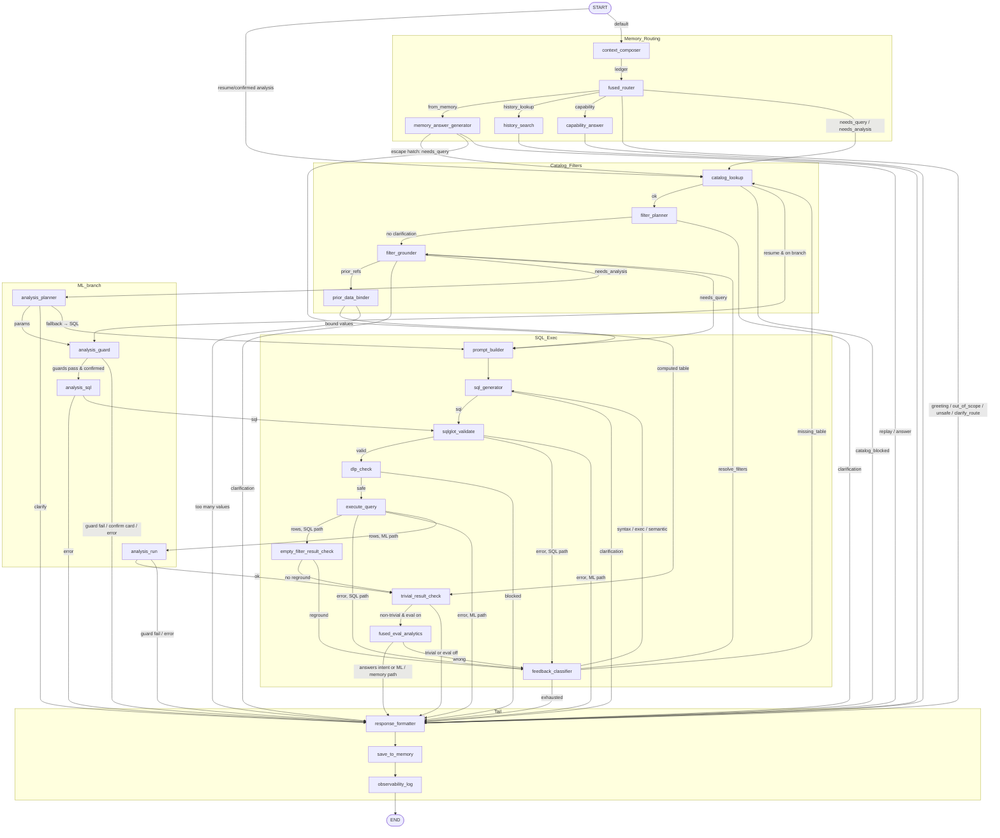

# Agent State Flow

LangGraph state graph for the Jeen Insights text-to-SQL agent
(`src/agent/langgraph_agent/graph.py`, `build_graph()`). Every question passes
through this graph from `START` to `END`. 25 nodes, 58 arcs, 20 conditional
routers, recursion limit 48, no checkpointer.

> Diagrams: [agent-state-flow.drawio](./agent-state-flow.drawio) — page 1 is the
> grouped overview, page 2 carries a description on every node and the routing
> condition on every arc.
> Full end-to-end path (UI → Flask → API → pre-graph → LangGraph → insights/charts):
> [question-to-answer-flow.md](./question-to-answer-flow.md).
> ML skills branch: [ml-skills.md](./ml-skills.md).

## Diagram

The subgraphs are logical groupings, not simultaneous execution. At runtime the
graph follows one route. The only real parallel work happens before `START`:
`JeenInsightsAgent.process_question()` uses `asyncio.gather()` to resolve the
user, load the conversation window, create the audit row and preload the
catalog.

## Execution and State Model

`AgentState` is a `TypedDict` with partial updates: each node returns only the
fields it changed and LangGraph merges them (last-writer-wins), except `trace`,
whose `operator.add` reducer appends one timing event per node. Every node is
wrapped by `_timed`, which also emits `node_started` / `node_finished` progress
events for the SSE route.

The graph is compiled once per data connection. There is no LangGraph
checkpointer: multi-turn continuity comes from the conversation window loaded
before `START` and written back by `save_to_memory`.

| State area | Important fields | How it is used |
|------------|------------------|----------------|
| Request and connection | `question`, `source_key`, `session_id`, connection schema/catalog | Defines the request and the allowed data source. |
| Memory | `conversation_history`, `memory_window`, `memory_ledger`, `prior_refs`, `memory_action`, `prior_bindings`, `history_query`, `memory_telemetry` | The last N turns and the compact ledger every prompt reads; which prior turns this question depends on; what the memory node did. |
| Routing | `route`, `route_source`, `route_reason`, `route_clarification` | Which branch answers the question. |
| Catalog and prompt | `metadata_bundle`, `known_tables`, `table_columns`, `filter_plan`, `resolved_filters`, `system_prompt` | Validation allowlists, verified filters and the prompt the SQL model sees. |
| SQL retry loop | `generated_sql`, `sqlglot_error`, `exec_error`, `error_context`, `retry_count` | Carries failure detail into the next generation attempt. |
| ML skills | `analysis_skill`, `analysis_params`, `analysis_proposal`, `analysis_result` | Planner → guard → sql → run branch (see ml-skills.md). |
| Result and evaluation | `query_result`, `is_trivial`, `eval_result` | Whether narration runs and the final answer/insights. |
| Output and telemetry | `formatted_response`, `token_usage`, `trace` | API payload and developer trace. |

## Conversation memory

The customer can ask about earlier questions **and their data**: "show that
again", "what was the max?", "what if prices were 10% higher?", "take the 4 most
expensive products from the previous answer and show me their sales", "did I ask
about revenue in the last 4 days?". The design is *ledger in the prompt, data by
reference*:

- **Window.** `conversation_context_turns` (runtime setting, default 5) completed
  turns of the current conversation are loaded before `START`, each with its
  question, SQL, stored answer, result artifact (columns, types, row count,
  stats) and snapshot status. In-flight turns are excluded.
- **Ledger.** `context_composer` renders them as `T1…TN` (~150–250 tokens per
  turn). The router, the SQL generator (as replayed `run_sql` tool calls whose
  result line says what came back and what was answered) and the memory nodes
  all read the same ledger. Rows never enter a prompt.
- **Data by reference.** `PriorResultStore` recovers a turn's rows cache →
  stored snapshot → re-run of the turn's SQL, and only re-runs at the source
  once a model has decided the rows are actually needed.
- **Compute, don't estimate.** `memory_answer_generator` exposes the referenced
  turn(s) to the metadata PostgreSQL as typed CTEs over JSONB bind parameters
  (`WITH insights_mem_t3 AS (SELECT * FROM jsonb_to_recordset($1::jsonb) AS t(…))`
  — no table is ever created; the `insights_` prefix that segregates every
  Insights object from Schema Modeler's `metadata_*` / `admin_*` tables names
  the CTEs too) inside a `READ ONLY` transaction with a statement timeout,
  and runs a sqlglot-validated SELECT the small model wrote nested as a
  subquery — only snapshot relations may be referenced, `insights_mem_*` CTE
  names are reserved, file/network/session/catalog functions are refused and
  validation fails closed, so the model's SQL can never reach `insights_*`
  data. The result is an ordinary
  `query_result` that flows through `trivial_result_check → fused_eval_analytics`
  like a live query. Replays return the stored table with its original answer
  and skip eval. The customer's source database is never touched by memory.
- **Composition.** When the router sets `prior_refs` on a `needs_query`,
  `prior_data_binder` extracts the needed values from the stored rows and emits
  them as a resolved `IN` filter; `prompt_builder` puts it in the filter
  contract and `sqlglot_validate` refuses SQL that drops or widens it. Above
  `MEMORY_MAX_BOUND_VALUES` the user is asked to narrow.
- **History lookup.** Meta-questions about past questions run one database
  search over the application history log — the same rows and scoping as the
  History log drawer (`get_history_log`: this user's queries on this
  connection), excluding the turn being answered — with no LLM call, and return
  `history_matches` (log-shaped entries plus the stored answer) for the UI.
- **Telemetry.** `metrics.memory` reports turns loaded vs window, ledger tokens,
  the memory action, per-turn data source (cache / snapshot / rerun) and rows
  used; the trace shows the same per node.

## Node Reference

| Node | Type | Description |
|------|------|-------------|
| `context_composer` | logic | Builds the turn ledger and memory telemetry from the loaded window. |
| `fused_router` | LLM (router) | Greeting regex short-circuit; else one call over the ledger → `route`, `prior_refs`, `history_query`, confidence. ML gate, keyword-cue upgrade, low-confidence `clarify_route`. |
| `capability_answer` | LLM (primary) | Explains the assistant and the skill catalog. |
| `memory_answer_generator` | LLM (router) | `replay` / `compute` (a Postgres SELECT over the stored rows exposed as `jsonb_to_recordset` CTEs, no tables) / `answer` / `needs_query` for a prior turn's answer or data. |
| `history_search` | DB | Keyword + time-window search over the application history log (`insights_conversation_sessions`, same scope as the History log drawer); deterministic answer. |
| `catalog_lookup` | DB / MCP | Loads the catalog (pre-graph bundle reused once), builds the table/column allowlists, fails closed. |
| `filter_planner` | LLM (router) | Binds ≤4 predicates in the question to catalogued columns. |
| `filter_grounder` | DB | Normalises typed operands and verifies text literals against distinct values. |
| `prior_data_binder` | LLM (router) | Extracts values from a referenced prior result and binds them as a resolved `IN` filter. |
| `prompt_builder` | logic | Renders the SQL system prompt (schema-linked) plus the runtime filter contract. |
| `sql_generator` | LLM (primary) | Tool-calling SQL generation; prior turns replayed from the ledger; error context on retries. |
| `sqlglot_validate` | tool | Parse, single read-only statement, schema qualifier, allowlists, resolved-filter preservation. |
| `dlp_check` | tool | Column-aware governed-pattern check. |
| `execute_query` | DB | Read-only runner with limit / row cap / statement timeout. |
| `empty_filter_result_check` | logic | One extra grounding pass on an empty result with unresolved text filters. |
| `trivial_result_check` | logic | ≤1 row and ≤5 columns skips eval. |
| `fused_eval_analytics` | LLM (primary) | Narration + `answers_intent`; ML results use the narration prompt and never trigger repair. |
| `feedback_classifier` | logic | `resolve_filters` / `missing_table` / `syntax` / `exec` / `semantic` / `exhausted`. |
| `analysis_planner` / `analysis_guard` / `analysis_sql` / `analysis_run` | LLM / DB / logic / ML | ML skills branch, see ml-skills.md. |
| `response_formatter` | logic | Picks the answer by terminal state and builds the API contract (`metrics.memory`, `history_matches`, `routing.memory_action` included). |
| `save_to_memory` | DB | Persists SQL, execution status, preview, result artifact and turn artifact (answer + snapshot). |
| `observability_log` | logic | One `QUERY_EVENT` structured log per run. |

## Arcs

Conditions are evaluated in order; the first match wins. `on_branch` =
`on_analysis_branch(state)`; `memory` = a table produced from stored rows.

| From | To | Condition |
|------|----|-----------|
| `START` | `catalog_lookup` | `analysis_resume` or `analysis_confirmed` (re-entry from `/api/analysis/run`) |
| `START` | `context_composer` | otherwise |
| `context_composer` | `fused_router` | always |
| `fused_router` | `memory_answer_generator` | `route == from_memory` |
| `fused_router` | `history_search` | `route == history_lookup` |
| `fused_router` | `capability_answer` | `route == capability` |
| `fused_router` | `response_formatter` | `route ∈ {out_of_scope, unsafe, greeting, clarify_route}` |
| `fused_router` | `catalog_lookup` | `needs_query` / `needs_analysis` (default) |
| `capability_answer` | `response_formatter` | always |
| `history_search` | `response_formatter` | always |
| `memory_answer_generator` | `catalog_lookup` | `route == needs_query` (escape hatch, or rows unrecoverable) |
| `memory_answer_generator` | `trivial_result_check` | `memory_action == compute` |
| `memory_answer_generator` | `response_formatter` | replay or prose answer |
| `catalog_lookup` | `response_formatter` | `catalog_blocked` |
| `catalog_lookup` | `analysis_guard` | resume/confirmed and `on_branch` |
| `catalog_lookup` | `filter_planner` | otherwise |
| `filter_planner` | `response_formatter` | `filter_clarification_required` |
| `filter_planner` | `filter_grounder` | otherwise |
| `filter_grounder` | `response_formatter` | `filter_clarification_required` |
| `filter_grounder` | `analysis_planner` | `route == needs_analysis` |
| `filter_grounder` | `prior_data_binder` | `prior_refs` non-empty |
| `filter_grounder` | `prompt_builder` | otherwise |
| `prior_data_binder` | `response_formatter` | `filter_clarification_required` (too many values) |
| `prior_data_binder` | `prompt_builder` | otherwise |
| `prompt_builder` | `sql_generator` | always |
| `analysis_planner` | `response_formatter` | `analysis_clarification` |
| `analysis_planner` | `prompt_builder` | planner fell back to SQL |
| `analysis_planner` | `analysis_guard` | otherwise |
| `analysis_guard` | `response_formatter` | guard failure / confirm card / `analysis_error` |
| `analysis_guard` | `analysis_sql` | otherwise |
| `analysis_sql` | `response_formatter` | `analysis_error` |
| `analysis_sql` | `sqlglot_validate` | otherwise |
| `sql_generator` | `sqlglot_validate` | `generated_sql` |
| `sql_generator` | `response_formatter` | clarification / empty |
| `sqlglot_validate` | `response_formatter` | `sqlglot_error` and `on_branch` |
| `sqlglot_validate` | `feedback_classifier` | `sqlglot_error` |
| `sqlglot_validate` | `dlp_check` | valid |
| `dlp_check` | `response_formatter` | `dlp_blocked` |
| `dlp_check` | `execute_query` | otherwise |
| `execute_query` | `response_formatter` | `exec_error` and `on_branch` |
| `execute_query` | `feedback_classifier` | `exec_error` |
| `execute_query` | `analysis_run` | rows and `on_branch` |
| `execute_query` | `empty_filter_result_check` | otherwise |
| `empty_filter_result_check` | `feedback_classifier` | `needs_filter_reground` |
| `empty_filter_result_check` | `trivial_result_check` | otherwise |
| `analysis_run` | `response_formatter` | guard failure / `analysis_error` |
| `analysis_run` | `trivial_result_check` | otherwise |
| `trivial_result_check` | `response_formatter` | `is_trivial` or eval disabled |
| `trivial_result_check` | `fused_eval_analytics` | otherwise |
| `fused_eval_analytics` | `response_formatter` | `on_branch`, `memory`, or `answers_intent ≠ false` |
| `fused_eval_analytics` | `feedback_classifier` | `answers_intent == false` |
| `feedback_classifier` | `response_formatter` | `exhausted` |
| `feedback_classifier` | `catalog_lookup` | `missing_table` |
| `feedback_classifier` | `filter_grounder` | `resolve_filters` |
| `feedback_classifier` | `sql_generator` | `syntax` / `exec` / `semantic` |
| `response_formatter` | `save_to_memory` | always |
| `save_to_memory` | `observability_log` | always |
| `observability_log` | `END` | always |

## Bounded cycles

- **SQL repair** — `feedback_classifier` increments `retry_count`; syntax,
  execution and semantic failures return to `sql_generator`; the fourth failure
  (`LANGGRAPH_MAX_RETRIES = 3`) is terminal.
- **Catalog refresh** — `missing_table` reloads the catalog and re-plans filters
  (same budget). `prior_data_binder` re-applies existing bindings without a
  model call on this path.
- **Filter reground** — one extra grounding pass (`empty_filter_diagnostics < 1`,
  `retry_count` untouched).

The ML branch and the memory branch have no cycle: a failure on either goes
straight to `response_formatter` (there is no system prompt to retry with).

## Operational Configuration

| Setting | Default | Effect |
|---------|---------|--------|
| `conversation_context_turns` (runtime) | `5` | Turns loaded per request; the memory window. Editable in Settings → Runtime (0–50). |
| `MEMORY_SAMPLE_ROWS` | `3` | Rows of a prior result shown to the memory models as a sample. |
| `MEMORY_COMPUTE_MAX_ROWS` | `2000` | Row ceiling for computing over a prior result (matches the snapshot cap). |
| `MEMORY_MAX_BOUND_VALUES` | `100` | Most values a prior result may contribute to a new query's `IN` list. |
| `HISTORY_LOOKUP_DEFAULT_DAYS` / `_MAX_RESULTS` | `30` / `10` | Default look-back and result cap for history questions. |
| `JEEN_RESULT_CACHE_*` | 5 per user / 30 min / 256 | Hot tier of `PriorResultStore`. |
| `CONVERSATION_SNAPSHOT_*` | 2000 rows / 1 MiB / last 100 turns | Durable tier of `PriorResultStore`. |
| `LANGGRAPH_MAX_RETRIES` | `3` | Repair attempts after an initial SQL failure. |
| `REQUIRE_CATALOG_FOR_QUERY` | `true` | Fail closed without a usable catalog. |
| `SQLGLOT_VALIDATION_ENABLED` | `true` | SQL structure and catalog validation before execution. |
| `SCHEMA_QUALIFIER_VALIDATION_ENABLED` | `true` | Reject qualified tables outside the connection's schema/catalog. |
| `DLP_ENABLED` / `DLP_GOVERNED_COLUMNS` | `true` / empty | Governed-column checks. |
| `EVAL_ANALYTICS_ENABLED` | `true` | Narration for non-trivial results unless overridden per request. |
| `SCHEMA_LINK_ENABLED` | `true` | Prunes large catalog context for the prompt only. |

## Standalone Insights Eval Graph

`build_insights_eval_graph()` defines a separate one-node graph, `START → eval →
END`, used by the insights API after a main query has returned. It uses
`InsightsState` rather than `AgentState`.

## Source

Graph definition: `src/agent/langgraph_agent/graph.py`
Node implementations: `src/agent/langgraph_agent/nodes/`
Memory: `nodes/context.py`, `nodes/memory_answer.py`, `nodes/binder.py`,
`nodes/history.py`, `src/agent/prior_results.py`, `src/agent/snapshot_sql.py`
