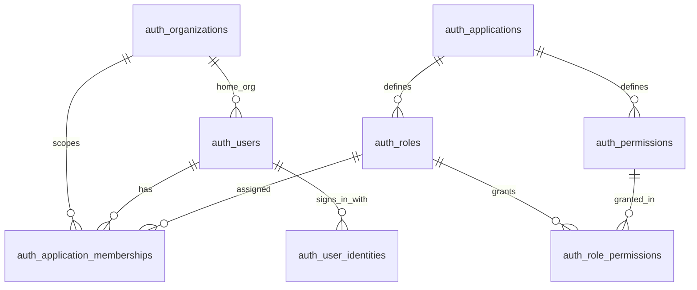
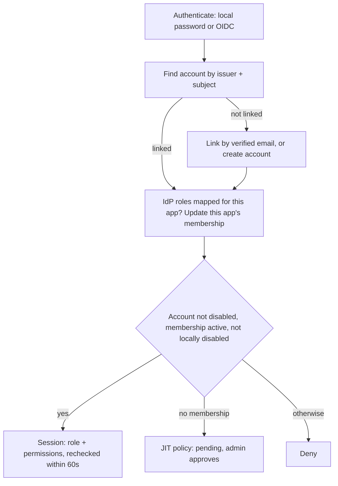

# Shared identity with per-application roles (Insights + Metadata)

**Status:** future plan, not started.

Jeen Insights and Jeen Schema Modeler (Metadata) share one account table, `auth_users`, in the metadata database. Today both apps read and write `auth_users.role`, so a role change in one app also changes the other. This plan keeps the shared account and gives each app its own access and role through shared `auth_*` tables.

## Work items

- [ ] Check `insights_schema_migrations` on every environment for `039_user_app_roles.sql`; delete it, or keep it and retire its table with a later migration.
- [ ] Run the identity set (`db/migrations/identity`, `auth_schema_migrations`) before the insights set in `scripts/run_insights_migrations.py`, with a fixed lock order and tests.
- [ ] Write `identity/001` (tables, seeds, `auth_users` additions, `lower(email)` index, membership and audit indexes, audit trigger function, sync function and backfill, Entra and 039 imports) and `identity/002` (validate constraints). The API verifies the identity tables at start.
- [ ] Rework Insights sign-in (`src/auth_db.py`, `src/ui_app.py`, `src/oidc_auth.py`, `src/entra_auth.py`): issuer + subject linking, membership checks, app-scoped IdP roles only, pending access on first SSO sign-in, `/setup`.
- [ ] Put permissions in the session and internal token; `require_permission` on FastAPI routes; Flask permission checks with a fresh DB lookup for admin actions; 60-second recheck; frontend shows screens by permission.
- [ ] Rebuild Settings → Users for Insights memberships (pending approvals, add by email, revoke, server-side checks, IdP-managed roles read-only, audit), with English and Hebrew strings.
- [ ] Update the deployment docs, configuration table and `.cursor/rules/defence-deploy.mdc` for the identity set, DB grants and new OIDC variables.
- [ ] Unit, integration (three `auth_users` shapes) and live/stress test updates.
- [ ] Phase 2 in the Schema Modeler repo (needs a separate go-ahead).
- [ ] Phase 3 cleanup in a later release.

## Decisions

- **Schema owner:** the Insights migration Job creates the new shared tables. They run as a separate `identity` migration set (`db/migrations/identity`, history table `auth_schema_migrations`) under an `auth_*` prefix. Schema Modeler only reads and writes rows.
- **Role authority is hybrid:** both apps enforce the DB membership. If an app has an IdP role mapping, each sign-in updates that app's membership.
- **First SSO sign-in to Insights without access:** the person is **pending** until an Insights admin approves them. Metadata stays pending until a Metadata admin approves them, as it works today.
- **GPT review** (GPT-5.6 Terra, read-only against both repos), two rounds. It agreed with the approach; its fixes are folded in:
  - account linking by verified email only
  - keep Metadata's per-service access list
  - privileged actions check the DB on every request
  - IdP roles read only from the app's own client or project, with no opt-in for realm roles or groups
  - a local disable the IdP cannot undo
  - no hard deletes of shared accounts
  - migration safety on `auth_users`, plus the indexes, grants and audit trigger function listed below
  - no `rank` column on roles

## Tables at a glance

**New tables (9), all created by the identity migration set:**

- `auth_schema_migrations`: history of the identity migrations
- `auth_organizations`: one default row for now (future multi-org)
- `auth_applications`: `insights`, `metadata`
- `auth_roles`: admin, editor, viewer for each app
- `auth_permissions`: the permission keys each app checks
- `auth_role_permissions`: which role gets which permission
- `auth_application_memberships`: a person's access and role in one app. This is the only table admins change day to day.
- `auth_user_identities`: Keycloak, Zitadel or Entra sign-ins linked to an account; holds the Zitadel user id
- `auth_audit_events`: who changed whose access, and when

**Other new database objects:**

- function `auth_sync_legacy_memberships(app)`: transitional; used for the backfill and at the Metadata cutover
- trigger function `auth_reject_audit_mutation()` and its trigger on `auth_audit_events`

**Changed table (1): `auth_users`**

- new columns: `home_organization_id`, `metadata` (JSON), `provisioned_by_application_key`
- new unique index on `lower(email)`
- the Insights-only CHECKs on `role` / `status` are dropped where they exist
- `role` becomes legacy (the Metadata role until Schema Modeler's cutover); only `status = 'disabled'` still applies to both apps

**Unchanged, but used differently:**

- `user_service_access` (Metadata's per-service access): unchanged
- `workspace_invitations`, `workspace_invitation_service_access`, `workspace_invite_links`: unchanged; from Phase 2, redeeming an invitation creates a membership
- `connector_identities`: read once to copy Entra identities
- `auth_accounts`: frozen once Schema Modeler stops writing it (Phase 2)

**Removed later:**

- `auth_accounts` in Phase 3, only where Metadata already runs on memberships
- `insights_user_app_roles`, only if migration 039 was ever applied somewhere

## Data model

- **`auth_users`** (existing, shared account):
  - Add `home_organization_id`. It defaults to the default org and is never used for authorization.
  - Add `metadata jsonb` for non-security attributes only.
  - Add `provisioned_by_application_key`, recording which app created the account.
  - Add a unique index on `lower(email)`.
  - `role` becomes legacy: it stays the Metadata role until Schema Modeler's cutover.
  - Only `status = 'disabled'` still applies to both apps.
- **`auth_organizations`** (for future use): `id uuid`, `key`, `name`, `idp_issuer` + `idp_org_id` (for example the Zitadel org), `metadata jsonb`. One default org is seeded with a fixed UUID.
- **`auth_applications`**: `key` (`insights`, `metadata`), `name`, and a transitional `role_source` (`memberships` or `auth_users_legacy`).
- **`auth_roles`** (`application_key`, `key`): admin, editor and viewer per app. When several IdP roles match, code picks the highest in the fixed order admin, editor, viewer.
- **`auth_permissions`** and **`auth_role_permissions`**: seed-only; they change through migrations, never through admins. Composite foreign keys mean a role can only hold permissions of its own app.
- **`auth_application_memberships`**, primary key (`organization_id`, `user_id`, `application_key`):
  - `role_key`, with a composite foreign key to that app's roles
  - `status`: active, pending or revoked
  - local override `disabled_at` / `disabled_by_user_id`; the IdP never clears it
  - `role_source`: local, idp, invite, jit or legacy
  - `source_issuer`, `granted_by_user_id`, timestamps, `last_login_at`
- **`auth_user_identities`**:
  - `user_id`, `provider`, `issuer`, `subject`, `email_at_link`, `idp_org_id`
  - `UNIQUE (issuer, subject)` and `UNIQUE (user_id, issuer)`; a link is never moved to another account
  - The Zitadel user id is the `subject` of the Zitadel row, so no `zitadel_user_id` column is needed.
  - Entra identities use `oid`, because Entra's `sub` differs for each app registration.
- **`auth_audit_events`**: append-only; `auth_reject_audit_mutation()` rejects UPDATE and DELETE. Records actor, app, target, action, and before/after values.
- **Stays owned by each app:** Metadata's `user_service_access` (per-service access list) and invitations; Insights' `connector_*` tables.
- **Why tables instead of a roles JSON:**
  - There is one row per user per app, so the two apps never overwrite each other's JSON.
  - Foreign keys guarantee the role exists for that app.
  - "Last admin" and "who has access" become indexed queries, and every change can be audited.
  - JSON is kept for non-security attributes only, namespaced by app and updated with `jsonb_set` / `||`.

## Permissions (same coverage as today's checks)

- **Insights:**
  - Admin gets `users.manage`, `settings.manage`, `mcp.manage`, `connectors.manage` and `analytics.view`.
  - Every role gets `workspace.use`.
  - Editor stays equal to viewer, as today.
- **Metadata:**
  - Every role gets `services.read`.
  - Editor and admin get `metadata.edit`.
  - Admin also gets `services.access_all`, `settings.manage`, `members.manage` and `rls.manage`.
  - Non-admins still need `user_service_access` rows for each service.

## Sign-in and access (both apps implement the same rules)

1. **One password per account.** It is shared by both apps' local login. SSO passwords stay in Keycloak or Zitadel.
2. **Linking an SSO sign-in to an existing account:**
   - Link by email only when all of these hold:
     - the IdP says `email_verified` is true (for direct Entra, only the one configured tenant)
     - exactly one account matches the email case-insensitively
     - that account has no identity from this issuer yet
   - Do the link in one transaction.
   - If the email matches an existing account but is unverified, deny sign-in and ask the person to contact an admin.
   - If no account has that email, create one.
3. **Reading IdP roles:**
   - Read only this app's roles:
     - Keycloak: `resource_access.<client>.roles`
     - Zitadel: `urn:zitadel:iam:org:project:<OIDC_ZITADEL_PROJECT_ID>:roles`
   - Realm roles, groups and top-level `roles` are never used for app roles. If one of them matches a configured role name, the sign-in logs a warning so operators can move it to a client role.
   - If `OIDC_
_VIEWER_ROLES` is unset, users with no mapped role become viewers (same as today). If it is set, they are denied and an existing IdP-managed membership is marked revoked.
   - A local disable always wins.
4. **Who gets in:**
   - Allow sign-in only if the account is not disabled, the membership is active, and `disabled_at` is null.
   - An account-level `pending` status (Metadata's older marker) no longer blocks Insights.
   - SSO sign-in with no membership: a pending membership is created and the person sees an "access pending" page.
   - Local sign-in with no membership: denied.
5. **Freshness:**
   - The session holds the role and permissions and is rechecked against the DB at least every 60 seconds.
   - User administration and settings writes check the DB on every request.
   - Insights mints its internal API token for each request from that state.

## Admin rules (each app's Users screen)

- Shows and edits only that app's memberships, including a Pending list to approve.
- "Add by email":
  - existing account: grant access and leave the password untouched
  - new email: create a local account with `provisioned_by` set to the app
- No editing another app's role. An app admin never sets the password of an existing shared account.
- "Remove" revokes that app's membership only. During the transition, no app screen hard-deletes a shared account.
- Checks enforced on the server:
  - no changes to your own membership
  - the last active admin of the app cannot be removed, demoted or disabled
  - IdP-managed roles are read-only; a local disable is still allowed
- Every change is written to `auth_audit_events`.

## Day-to-day management

- **App admins** use only their app's Users screen:
  - approve a pending person, change their role, revoke access, or disable them locally
  - give someone access to the other app: an admin of that app adds them there; the account and password are shared
  - IdP-managed users: the role is shown read-only and is changed in Keycloak or Zitadel
- **Operators** configure; they never edit rows by hand:
  - IdP role mapping per app in Helm values / env: `OIDC_
_ADMIN_ROLES`, `OIDC_
_EDITOR_ROLES`, `OIDC_
_VIEWER_ROLES`, `OIDC_ZITADEL_PROJECT_ID`
  - applications, roles, permissions and the default org change only through identity migrations
  - "Why can't X sign in?" follows one path: account disabled, identity link, membership for that app, local disable, IdP role mapping, and for Metadata the service grant. The audit table records who changed what.
- **Developers:** guard a new route with an existing permission. A new permission is one seed row plus its role grants in an identity migration, and a test.
- **A third app later:** seed its application, roles and permissions in an identity migration and give it its own IdP client or project. No schema change.
- **Transition-only pieces** are removed in Phase 3: `role_source`, `auth_sync_legacy_memberships`, the account-level `pending` marker for Insights-created accounts, and copying the Metadata role into `auth_users.role`. The conditions: both apps run on memberships, nothing reads `auth_users.role`, and no rollback target needs it.

## Rollout (expand/contract)

### Phase 0: identity migration set (this repo, same Job)

- **Runner** (`scripts/run_insights_migrations.py`):
  - Run the identity set first, then the insights set.
  - Each set has its own history table and checksum preflight.
  - Take both advisory locks in a fixed order (identity, then insights) for the whole run.
  - The Job command does not change.
- **`db/migrations/identity/001_*`:**
  - `SET LOCAL lock_timeout = '3s'` before touching `auth_users`.
  - `CREATE TABLE IF NOT EXISTS auth_users` with every column both apps need, for new databases.
  - Drop the Insights-only CHECKs on `auth_users.role` / `status` where they exist.
  - Create the tables, CHECKs and seeds.
  - Add the new `auth_users` columns with foreign keys marked `NOT VALID`.
  - Create the `lower(email)` unique index.
  - Membership indexes: `(organization_id, application_key, status, user_id)` for listing, `(user_id, application_key, organization_id)` for per-user lookups, and a partial index on active admins of an app for the last-admin check. Audit indexes: `(application_key, target_user_id, occurred_at DESC)` and `(actor_user_id, occurred_at DESC)`.
  - `auth_reject_audit_mutation()` and its trigger on `auth_audit_events`.
  - Create `auth_sync_legacy_memberships(app)` and run it for both apps. It maps the legacy `user` role to editor, account `pending` to a pending membership, and account `disabled` to `disabled_at`.
  - Copy Entra identities from `connector_identities` (tenant issuer + `oid`) and import `insights_user_app_roles`, each only if that table exists.
- **`identity/002`:** `VALIDATE CONSTRAINT` for the foreign keys added as `NOT VALID`.
- **API start:** verifies the identity tables (new `src/metadata/identity_schema.py`, called from `src/api/lifespan.py`).
- **Grants** (documented in `deployment/migrations.md`):
  - The migration role owns the DDL.
  - App DB roles get SELECT on applications, roles, permissions and organizations; SELECT, INSERT, UPDATE and DELETE on memberships and identities; INSERT and SELECT only on the audit table.
  - Where the Job and the apps share one DB user (the defence Job reads the same `jeen-insights-secrets`), the audit trigger is what keeps the table append-only.
- **Runbook:**
  - Check first that there are no case-insensitive duplicate emails.
  - Do not restart Schema Modeler while the Job runs.
  - Confirm whether `039_user_app_roles.sql` appears in `insights_schema_migrations` on any environment. If it does, keep that file and retire the table with a later migration.

### Phase 1: Insights app (same release)

- **[src/auth_db.py](../../src/auth_db.py):**
  - identity and membership queries, the linking transaction, IdP role sync, audit writes
  - new accounts get `role='viewer'`, `status='pending'`, `provisioned_by='insights'`, so they stay out of Metadata until a Metadata admin approves them
  - never writes `auth_users.role`
- **[src/ui_app.py](../../src/ui_app.py):**
  - local, Entra and OIDC callbacks follow the rules above
  - `/setup` counts active Insights admin memberships; if the email already has an account, it verifies that account's password and then grants Insights admin
  - "access pending" and "no access" pages
  - 60-second recheck in `_require_login`
  - permission checks replace `_admin_required`
- **[src/oidc_auth.py](../../src/oidc_auth.py):**
  - return `iss`, `sub` and `email_verified`
  - read only the app's own role claims; log a warning when a realm role or group matches a configured role name
  - new variables: `OIDC_ZITADEL_PROJECT_ID` and `OIDC_
_VIEWER_ROLES`
- **[src/entra_auth.py](../../src/entra_auth.py):** the identity is the tenant issuer plus `oid`.
- **[src/security/internal_auth.py](../../src/security/internal_auth.py) and [src/api/dependencies.py](../../src/api/dependencies.py):**
  - a `permissions` claim and `require_permission(...)`
  - the settings, runtime, MCP, connectors and admin-analytics routes switch from `require_admin` to it
- **UI:**
  - [src/static/settings/settingsPage.js](../../src/static/settings/settingsPage.js): the Users tab shows Insights only, with pending approvals and revoke; screens are shown based on `permissions` from `/api/auth/me`
  - Hebrew and English strings, CSS
- **Remove the interim Metadata-role work:** the Metadata-role column, `039_user_app_roles.sql` (only if no environment has applied it), and `tests/unit/test_user_app_roles.py`.
- **Docs and rules:** `deployment/migrations.md`, `deployment/oidc.md`, `deployment/configuration.md`, `deployment/k8s_dev/README.md`, the OpenShift docs, and `.cursor/rules/defence-deploy.mdc`. The identity set may touch `auth_users` and the new `auth_*` tables, never `auth_accounts` until the guarded Phase 3 drop.

### Phase 2: Schema Modeler (`/Users/Hertz/code/schema-modeler`)

This is a separate repo. I'll check with you before the first edit there.

- Detect the identity tables at startup. If they are missing (Schema Modeler installed without Insights), keep today's behavior.
- **One-time cutover**, under an advisory lock:
  - run `auth_sync_legacy_memberships('metadata')`
  - copy existing Keycloak, Zitadel and OIDC links from `auth_accounts` into `auth_user_identities`, using Schema Modeler's configured issuers
  - set `role_source = 'memberships'`
  - Entra rows in `auth_accounts` hold the per-app `sub`, so those users link again at their next sign-in under the rules above.
- **`lib/auth.ts` and `lib/auth-db.ts`:**
  - same linking rules (issuer + subject; `oid` for Entra)
  - invitations and JIT create the membership and its `user_service_access` rows in one transaction
  - stop writing `auth_accounts`; skip the startup DDL for `auth_*` tables
- **Authorization:**
  - load the role and permissions into the JWT from the Metadata membership
  - base `lib/roles.ts`, `lib/rbac.ts`, `lib/members-auth.ts` and `lib/rls/rls-auth.ts` on permissions
  - move `lib/members-db.ts` and `MembersSettings.tsx` onto memberships (revoke instead of delete, last-admin check per app)
- **Rollback safety:** for one release, also copy the Metadata role into `auth_users.role`. Never copy membership status into `auth_users.status`.
- **Optional:** IdP role mapping for Metadata, with the same own-client / own-project rules.

### Phase 3: contract (later release)

- Stop copying the role into `auth_users.role`.
- Drop `auth_sync_legacy_memberships` and `role_source`.
- Drop `auth_accounts` in a guarded migration that runs only when the `metadata` application already has `role_source = 'memberships'`. A standalone Schema Modeler install never runs the identity set, so it keeps its table.
- Mark `auth_users.role` deprecated.

## IdP setup guidance

- **Keycloak:** one client per app, with app roles as client roles. On the brokered Entra provider, turn on "Trust email" only if Entra emails are trusted; otherwise the first link needs an admin.
- **Zitadel:** one project per app, or role keys prefixed with the app name. Turn on "Assert Roles on Authentication". Optionally turn on "Check authorization on Authentication" so users with no grant are blocked at the IdP.

## Limits during the transition

- **Until Schema Modeler's cutover,** Metadata still reads `auth_users.role` and `status`. Deleting a member in Metadata still deletes the account, which also removes Insights access. Disabling someone in Metadata still disables them in both apps.
- **Rolling Insights back** after this release: roll back only to a build that already uses memberships. Older builds read roles from `auth_users.role` and block the pending accounts the new Insights creates.
- **Rolling Schema Modeler back** after its cutover: its roles must first be copied back into `auth_users` with a SQL script we will document.

## Tests

- **Runner:** two sets, lock order, a history table and checksums per set, preflight for missing files, consecutive numbering per folder (`tests/unit/analytics/test_usage_ledger.py`).
- **Integration** (`JEEN_E2E_DB=1`):
  - run both sets against three `auth_users` shapes:
    - a new database
    - a table shaped like Schema Modeler's (role `user`, pending/disabled accounts, mixed-case emails)
    - a table created by Insights migration 008
  - check the backfill and sync results, and that the audit trigger rejects UPDATE and DELETE
- **Unit:**
  - linking: verified email, ambiguous match, Entra tenant check, no moving links
  - access checks: account disabled; account-level pending still allowed into Insights; membership pending, revoked or disabled
  - IdP scope: a realm role named `admin` is ignored and logged
  - a local disable survives the IdP sync
  - user-admin checks, permissions in the token and `require_permission`, i18n keys
- **Live and stress:**
  - `features.admin.live.spec.js` and `security.live.spec.js` use a fixed test email and revoke instead of delete
  - `tests/stress/lib/users.js` grants access again to existing stress accounts
