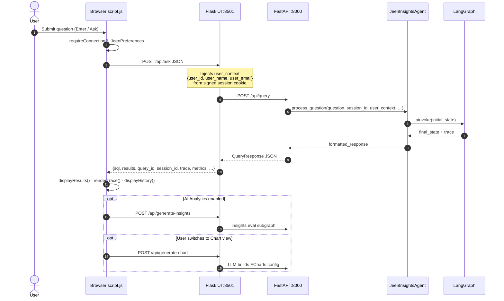
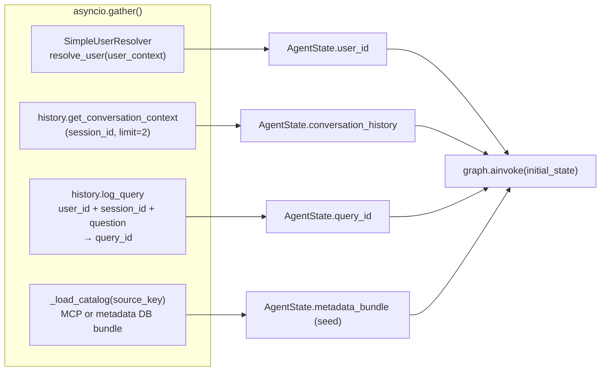
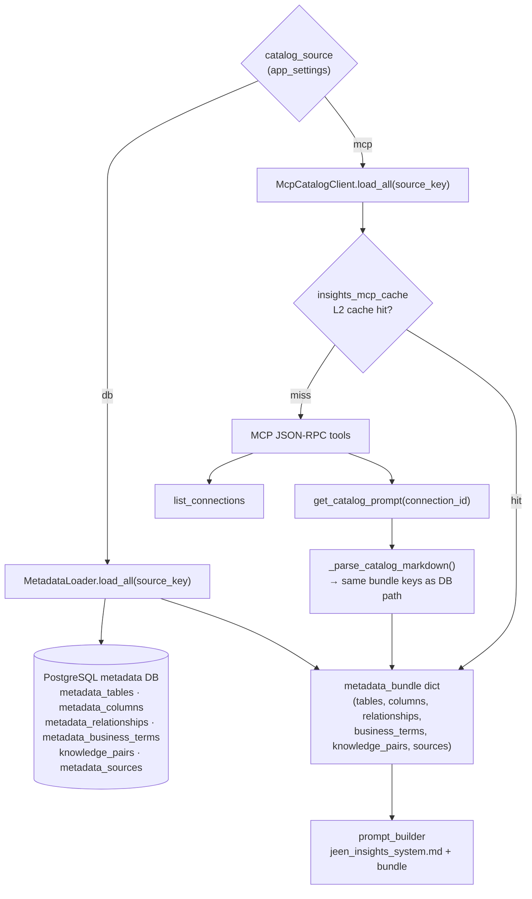
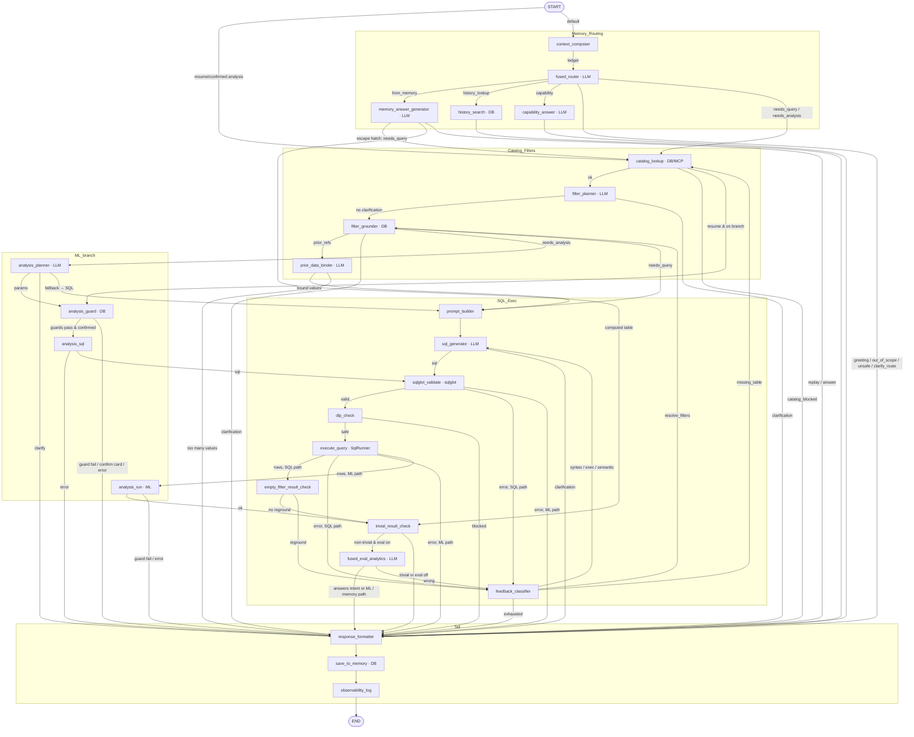
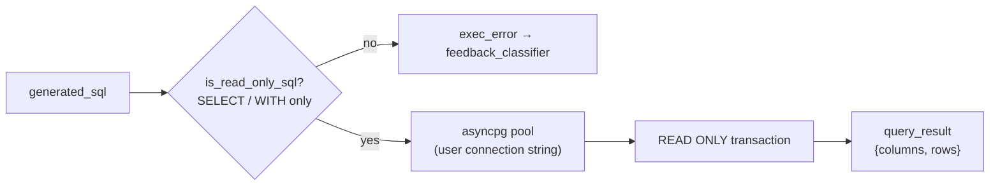
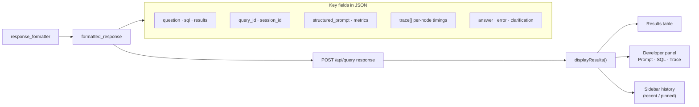
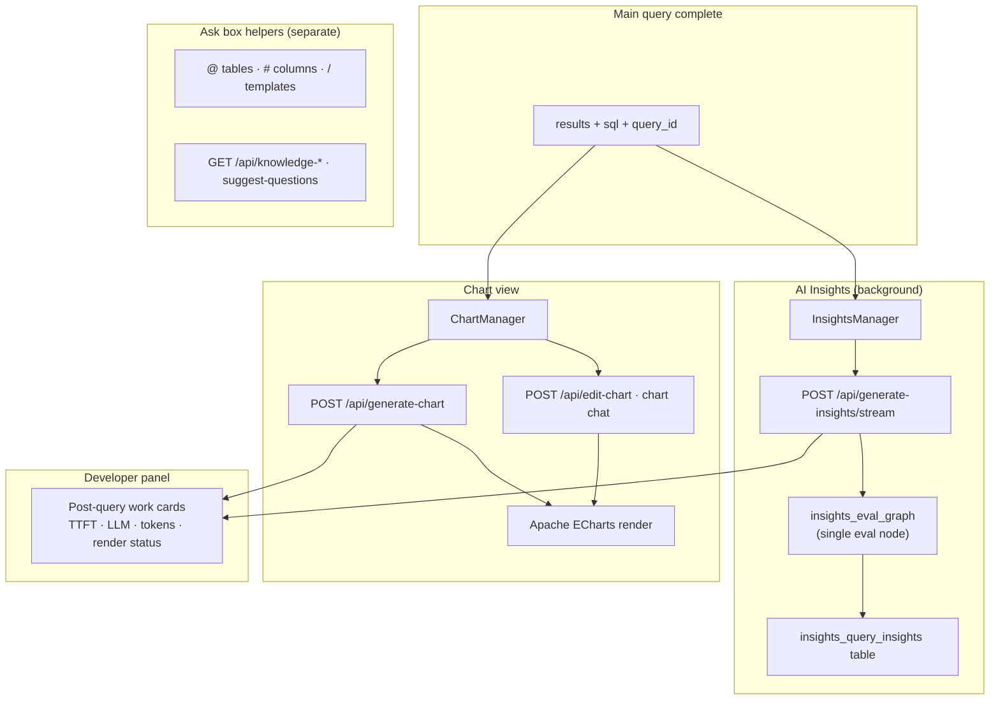
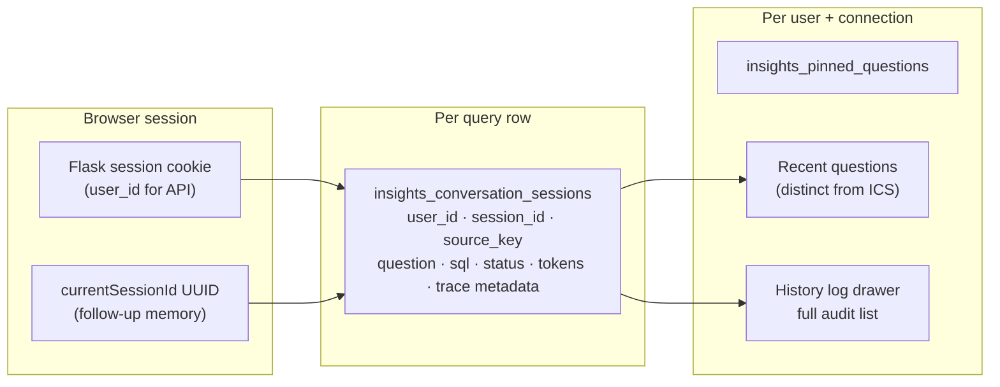

# Question → Answer: Complete Flow

End-to-end path from a user typing a question in the browser to seeing results,
insights, and charts. Includes the Flask UI layer, FastAPI backend, LangGraph
agent, metadata catalog (DB or MCP), SQL tools, and optional follow-up LLM calls.

For LangGraph node details only, see also [agent-state-flow.md](./agent-state-flow.md).

**Draw.io:** Open [question-to-answer-flow.drawio](./question-to-answer-flow.drawio) in
[diagrams.net](https://app.diagrams.net/) or the Draw.io VS Code extension (9 pages).
Regenerate after edits with `python3 scripts/generate_question_flow_drawio.py`.

---

## 1. End-to-end overview

```mermaid
flowchart TB
    subgraph Browser["Browser (index.html + script.js)"]
        QIN["User types question"]
        ASK["POST /api/ask\n{question, connection, session_id, limit, temperature}"]
        DISP["displayResults()\nTable · SQL · Prompt · Trace"]
        INS["InsightsManager\nPOST /api/generate-insights"]
        CHART["ChartManager\nPOST /api/generate-chart"]
    end

    subgraph FlaskUI["Flask UI (ui_app.py)"]
        AUTH["Session auth\nuser_context from login"]
        PROXY["Proxy → FastAPI /api/query"]
    end

    subgraph FastAPI["FastAPI API (src/api)"]
        QUERY["POST /api/query"]
        AGENT["JeenInsightsAgent.process_question()"]
        INSAPI["POST /api/generate-insights"]
        CHARTAPI["POST /api/generate-chart"]
    end

    subgraph PreGraph["Pre-graph bootstrap (parallel)"]
        USER["SimpleUserResolver\n→ user_id"]
        CTX["ConversationHistory\nlast Q&As for session_id"]
        AUDIT["ConversationHistory.log_query\n→ query_id"]
        CAT0["Catalog preload\nMCP or metadata DB"]
    end

    subgraph LangGraph["LangGraph text-to-SQL graph"]
        LG["25 nodes: memory ledger → router → SQL / ML / memory → validate → execute → eval → format"]
    end

    subgraph DataSources["Data & catalog"]
        META["Metadata DB\nmetadata_* · knowledge_pairs"]
        MCP["MCP server\nlist_connections · get_catalog_prompt"]
        PG["User PostgreSQL\n(read-only SELECT)"]
        HIST["insights_conversation_sessions\naudit + memory"]
    end

    QIN --> ASK --> AUTH --> PROXY --> QUERY --> AGENT
    AGENT --> USER & CTX & AUDIT & CAT0
    AGENT --> LG
    LG --> META & MCP & PG & HIST
    LG --> DISP
    DISP --> INS --> INSAPI
    DISP --> CHART --> CHARTAPI
    INSAPI --> LG
    CHARTAPI --> LLM2["LLM (ECharts JSON)"]

    classDef ui fill:#dbeafe,stroke:#2563eb,color:#1e3a8a
    classDef api fill:#fef3c7,stroke:#d97706,color:#78350f
    classDef graph fill:#ede9fe,stroke:#7c3aed,color:#4c1d95
    classDef db fill:#d1fae5,stroke:#059669,color:#064e3b
    class QIN,ASK,DISP,INS,CHART ui
    class QUERY,AGENT,INSAPI,CHARTAPI,PROXY,AUTH api
    class LG graph
    class META,MCP,PG,HIST db
```

---

## 2. UI → API request path



---

## 3. Pre-graph bootstrap (before LangGraph START)

Three independent DB/API calls run **in parallel** inside `JeenInsightsAgent.process_question()` before the graph starts. Results seed `AgentState`.



| Step | Service | Storage / tool | Purpose |
|------|---------|----------------|---------|
| User resolution | `SimpleUserResolver` | Flask session → `user_context` | Per-user history, audit rows |
| Short-term memory | `ConversationHistoryService` | `insights_conversation_sessions` | Last 2 Q&As for follow-ups |
| Audit log | `ConversationHistoryService` | `insights_conversation_sessions` | `query_id` for trace & feedback |
| Catalog preload | `MetadataLoader` or `McpCatalogClient` | See §4 | Warm metadata bundle (optional; node reloads too) |

---

## 4. Catalog source: Metadata DB vs MCP

The `catalog_lookup` node (and pre-graph preload) route to **one** catalog provider based on `app_settings.catalog_source`.



**MCP tools** (when catalog source = `mcp`):

| MCP tool | Catalog need | Returns |
|----------|--------------|---------|
| `list_connections` | `list_sources` | Connection list (`source_key` ↔ `connection_id`) |
| `get_catalog_prompt` | `list_tables` | Full markdown catalog (all sections) |
| `get_filtered_prompt` | `describe_table` | Filtered catalog (optional) |

---

## 5. LangGraph agent (core question → SQL → answer)

The compiled graph has **25 nodes** and 58 arcs. Every node appends a timed event to `state.trace` (shown in the UI developer panel). The full node reference, the arc table with routing conditions, and the conversation-memory design live in [agent-state-flow.md](./agent-state-flow.md) (diagrams: [agent-state-flow.drawio](./agent-state-flow.drawio)); the overview below is the same graph grouped by phase — the graph follows one route through it for a given question.



Only the pre-graph bootstrap in §3 runs concurrent work with `asyncio.gather()`. The LangGraph trace itself is sequential per route, even though the UI and docs lay out alternative branches side-by-side.

### Router outcomes (`fused_router`)

| Route | Next path | Meaning |
|-------|-----------|---------|
| `needs_query` | `catalog_lookup` → filters → SQL pipeline (via `prior_data_binder` when `prior_refs` is set) | Normal analytics question, possibly building on a prior result |
| `needs_analysis` | `catalog_lookup` → filters → ML branch | Prediction / anomaly / driver question (see [ml-skills.md](./ml-skills.md)) |
| `from_memory` | `memory_answer_generator` | About a prior turn's answer or data: replay, compute over the stored rows, or answer from the ledger |
| `history_lookup` | `history_search` | "Did I ask about X last week?" — searched in the History log |
| `capability` | `capability_answer` | A question about the assistant itself |
| `clarify_route` | `response_formatter` | SQL-vs-ML genuinely ambiguous; the user picks |
| `greeting` | `response_formatter` | Short-circuit hello (regex, no LLM) |
| `out_of_scope` | `response_formatter` | Not a data question |
| `unsafe` | `response_formatter` | Blocked intent |

### Tools used inside the graph

| Node | Tool / library | Role |
|------|----------------|------|
| `sqlglot_validate` | **sqlglot** | Parse SQL, single read-only statement, allowlists, verified filters preserved |
| `dlp_check` | **DLP regex rules** | Block sensitive columns / dangerous patterns |
| `execute_query` | **SqlRunner** (Postgres / Trino / Databricks) | Read-only `SELECT`/`WITH` on the user's data source |
| `catalog_lookup` | **MetadataLoader** or **McpCatalogClient** | Schema + business context for prompts |
| `filter_grounder` | **value probes** (metadata / MCP / bounded SQL) | Verify literal values before SQL is written |
| `memory_answer_generator`, `prior_data_binder` | **PriorResultStore** + **SnapshotSqlEngine** | Recover a prior result's rows (cache → snapshot → re-run) and compute over them in the metadata Postgres, exposed as `insights_mem_*` CTEs over `jsonb_to_recordset` bind parameters (no tables created) |
| `history_search` | **ConversationHistoryService.search_turns** | Keyword + time-window search of the History log |
| `save_to_memory` | **ConversationHistoryService** | Update row: SQL, latency, tokens, status, preview, artifact, snapshot |

### LLM prompts (file → node)

| Prompt file | Used by |
|-------------|---------|
| `fused_router.md` | `fused_router` |
| `capability_answer.md` | `capability_answer` |
| `memory_answer.md` | `memory_answer_generator` |
| `sql_filter_planner.md` | `filter_planner` |
| `prior_data_binder.md` | `prior_data_binder` |
| `jeen_insights_system.md` | `prompt_builder` (injected catalog) |
| `sql_generator.md` | `sql_generator` (retry message) |
| `analysis_planner.md` | `analysis_planner` |
| `fused_eval_analytics.md` / `analysis_narration.md` | `fused_eval_analytics` (SQL results / ML results) |

Prompts are loaded via `PromptLoader` / `PromptCache` (DB-backed with file fallback).

---

## 6. SQL execution tool



Implementation: `src/tools/sql_tool.py` → `PostgresSqlRunner.run_sql()`

---

## 7. Response back to the UI



After the graph completes, `JeenInsightsAgent` attaches the full **execution trace** (including `save_to_memory` and `observability_log`) to the API response for the developer log panel.

---

## 8. Optional follow-up flows (same session)

These run **after** the main query returns rows. They use separate API endpoints and (for insights) a small LangGraph subgraph.
The Developer panel shows them as **Post-query work** so their latency is visible without mixing it into the main `/api/ask` LangGraph trace.



| Feature | Endpoint | LLM / graph |
|---------|----------|-------------|
| Insights summary | `/api/generate-insights/stream` | `build_insights_eval_graph` → `fused_eval_analytics`; streamed TTFT, LLM time, and tokens appear in Developer panel post-query work |
| Chart generation | `/api/generate-chart` | LLM chart-spec decision + server-built ECharts option; request/render/cache status appears in Developer panel post-query work |
| Chart refinement | `/api/edit-chart` | `chart_editor.md` + client `chartOperators` |
| Autocomplete `/` | `/api/knowledge-questions` | No LLM (DB `knowledge_pairs`) |
| Autocomplete tier 3 | `/api/suggest-questions` | `autocomplete_suggestions.md` |

---

## 9. Persistence & user scoping



---

## 10. Source files (quick index)

| Layer | Path |
|-------|------|
| Browser | `src/static/script.js`, `src/templates/index.html` |
| Flask proxy | `src/ui_app.py` |
| Query API | `src/api/routes/query.py` |
| Agent orchestrator | `src/agent/jeen_insights_agent.py` |
| LangGraph graph | `src/agent/langgraph_agent/graph.py` |
| Graph nodes | `src/agent/langgraph_agent/nodes/*.py` |
| SQL tool | `src/tools/sql_tool.py` |
| Metadata DB loader | `src/metadata/metadata_loader.py` |
| MCP catalog client | `src/metadata/mcp_catalog_client.py` |
| Conversation history | `src/agent/conversation_history.py` |
| Insights subgraph | `src/api/routes/insights.py` |
| Charts | `src/api/routes/charts.py`, `src/static/chart-feature/` |
| LLM service | `src/agent/llm_service.py` (`LangChainLlmService`) |

---

## Related docs

- [agent-state-flow.md](./agent-state-flow.md) — LangGraph-only diagram and node reference
- [../README.md](../README.md) — API endpoint list and architecture overview
- [../PROMPTS.md](../PROMPTS.md) — Prompt inventory
